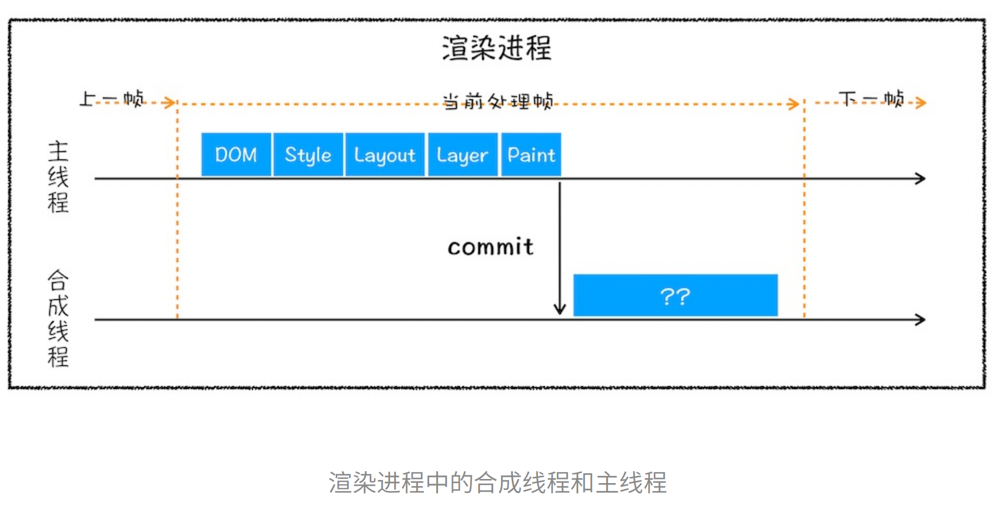

# HTML

## src与href的区别

- `src`(source),用于指定当前文档中要嵌入的外部资源的位置(这就是为什么src也叫统一资源定位符).例如`<script src="script.js"></script>`用于引入外部的JavaScript文件.当浏览器解析到带有`src`属性的元素时,会**暂停**当前文档的加载和解析,去下载并执行或显示指定的资源
- `href`(hypertext reference)用于建立当前文档与引用资源之间的联系.例如`<a href="https://www.example.com">Link</a>`用于创建一个指向外部网页的链接，或者`<link href="styles.css" rel="stylesheet">`用于引入外部的CSS样式表。浏览器在解析到带有`href`属性的元素时，会同时进行当前文档和引用资源的加载和处理，而不会阻塞当前文档的解析。

总结:

- `src`用于替换当前元素，指向的资源会嵌入到文档中，例如脚本、图像、框架等。
- `href`用于建立文档与引用资源之间的链接，例如链接到其他文档或引入外部样式表。


# CSS

## 盒模型

### 什么是盒模型?

内容区(content)+填充(padding)+边框(border)+边界(margin)

### W3C盒模型(标准盒模型)

模型图:


盒子总宽度:margin+border+padding+width

盒子总高度:margin+border+padding+height

### IE盒模型(怪异盒模型)

模型图:


盒子总宽度:width(content+padding+border)+margin

盒子总高度:height(content+padding+border)+margin

页面渲染时,`dom`元素采用的布局模型可以通过box-sizing来设置

box-sizing:content	标准盒模型

box-sizing:border	怪异盒模型

box-sizing:inherit	继承父元素的盒子模型

## BFC

块级格式化上下文(block formatting context),是一个独立的渲染区域,让处于bfc内部和外部的元素相互隔离,使内外元素的定位互不影响

开启bfc的方式:

根元素:`HTML`

开启绝对定位:`position: absolute/fixed`

浮动:`float:left/right`

行内块元素:`display:inline-box/table/flex/grid`

`overflow:auto/scroll/hidden`

### 应用场景

1.解决外边距重叠

2.父元素高度塌陷

3.自适应多栏布局

## 选择器

### 种类

类选择器,标签选择器,id选择器,属性选择器,通配选择器,兄弟选择器,后代选择器,伪类选择器,伪元素选择器

### 权重

1. `!important`
2. 内联样式
3. id选择器
4. 类选择器
5. 标签选择器
6. 通配符选择器
7. 浏览器自定义或继承

同级别:后写的覆盖先写的

**css选择器的解析原则：选择器定位DOM元素是从右往左的方向，这样可以尽早的过滤掉一些不必要的样式规则和元素**

## 清除浮动

1.在浮动元素后添加`clear:both`的空`div`元素

```html
<div class="container">
    <div class="left"></div>
    <div class="right"></div>
    <div style="clear:both"></div>
</div>
```

2.给父元素添加 `overflow:hidden` 或者 `auto` 样式，触发`BFC`

3.使用伪元素，也是在元素末尾添加一个`.`并带有 `clear: both` 属性的元素实现的。

```vue
<div class="container clearfix">
    <div class="left"></div>
    <div class="right"></div>
</div>

.clearfix:after{
    content: ".";
    height: 0;
    clear: both;
    display: block;
    visibility: hidden;
}
```

**推荐使用第三种方法，不会在页面新增div，文档结构更加清晰**

## 垂直居中

### 绝对定位+transform

**该方法可以不定宽高**

```css
.father {
  position: relative;
}
.son {
  position: absolute;
  left: 50%;
  top: 50%;
  transform: translate(-50%, -50%);
}
```

### 绝对定位+margin:auto

开启绝对定位,将子元素各个方向设置为0,使用`margin:auto`实现各方向自动平分

该方法需要盒子**指定宽高**

```css
.father {
  position: relative;
}
.son {
  position: absolute;
  top: 0;
  left: 0;
  right: 0;
  bottom: 0px;
  margin: auto;
  height: 100px;
  width: 100px;
}
```

### 绝对定位+margin:负值

开启绝对定位,利用`top:50%`+`left:50%`,之后通过手动设置`margin-left`和`margin-right`为负值,且值为子元素宽高的一半

**该方法需要指定宽高**

```css
.father {
  position: relative;
}
.son {
  position: absolute;
  left: 50%;
  top: 50%;
  width: 200px;
  height: 200px;
  margin-left: -100px;
  margin-top: -100px;
}
```

### 弹性布局

父元素开启弹性盒子,设置`justify-content: center`+`align-items: center`

**该方法可以指定宽高,也可以不指定**

```css
.father {
            background-color: #ccc;
            display: flex;
            width: 300px;
            height: 300px;
            justify-content: center;
            align-items: center;
        }

        .son {
            background-color: #f00;
            width: 100px;
            height: 100px;
        }
```

### 小结

- 内联元素

	水平居中:

	​    行内元素:`text-align:center`

	​    父元素设置弹性盒子:`display: flex; justify-content: center`

	垂直居中:

	​    单行文本:`height === line-height`(需要知道父元素高度)

	​    多行文本:`display: table-cell; vertical-align: middle`

- 块级元素

	水平居中:

	​    设置宽度+`margin:0 auto`

	​    绝对定位+`left:50%`+`margin:负自身一半`

	垂直居中:

	- `position: absolute`设置`left`、`top`、`margin-left`、`margin-top`(定高)
	- `display: table-cell`
	- `transform: translate(x, y)`
	- `flex`(不定高，不定宽)
	- `grid`(不定高，不定宽)，兼容性相对比较差


## CSS3新特性

CSS:层叠样式表,是一种标记语言,由浏览器执行使页面变得更美观

新特性:选择器,新样式,transition,transform,animation,渐变

### 选择器


### 新样式

#### 边框

`border-radius`:设置圆角边框

`box-shadow`:设置盒子阴影

`border-image`:使用图片绘制边框

### transition(过渡)

`transition`属性可以被指定为一个或多个CSS属性的过渡效果，多个属性之间用逗号进行分隔，必须规定两项内容：

- 过度效果
- 持续时间

```text
transition： CSS属性，花费时间，效果曲线(默认ease)，延迟时间(默认0)
```

### transform(变换)

包括:平移,旋转,倾斜,缩放

### animation(动画)

### 渐变

多用于颜色

`linear-gradient`:线性渐变

`radial-gradient`:径向渐变

### 其他

`flex`布局

`grid`布局

媒体查询

## 隐藏页面元素

`display:none` 元素从文档流中消失,不占据空间,无法交互

` visibility: hidden` 占据空间,但不能交互

二者区别:

`overflow:hidden` 隐藏溢出部分,但占据空间,不可交互

`transform:scale(0,0)` 平面变换，将元素缩放为`0`，但是依然占据空间，但不可交互

`opacity:0` 透明度设置为0,但依然占据空间,可以交互

`z-index:-9999` 本质上是将层级放到最底部,被其它元素覆盖

## 自适应布局

根据不同设备或窗口尺寸自动调整布局的设计方式

实际开发中，主要通过flex布局+百分比设置宽高，以及对弹性项的伸缩属性进行调整，以此实现元素的布局。

## px,vw,vh,em,rem的区别

相对长度单位:vw,vh,em,rem

绝对长度单位:px

px,表示像素,所谓像素就是呈现在显示器上的一个个小点

vw就是根据窗口宽度,将窗口分成一百等份,vh同理,将窗口高度分成一百等份.100vw就表示满宽,50vw表示半宽

em:相对单位,基准点为父节点字体的大小,若自身设置了字体大小(浏览器默认字体大小为16px)则以自身为准

rem:相对单位,可理解为`root em`,以根节点`html`的字体大小为准

# JavaScript

## 数据类型基础

### var	let	const区别

- `var` 存在提升，我们能在声明之前使用。`let`、`const` 因为暂时性死区的原因，不能在声明前使用
- `var`在全局作用域下声明会被挂载到`window`对象上，另外两个则不会
- `const`声明的变量不能再次赋值,let可以

### 暂时性死区

变量在代码块内部被声明之前,无法被访问或使用的现象.在该区域内访问或使用变量都会导致引擎抛出错误

## 词法作用域

JavaScript中的词法作用域是指，变量的作用范围是在代码书写阶段就被确定的，而不是运行时确定的。也就是说，变量与函数在他们被声明时，对应的词法作用域就被确定了，而与函数调用时的位置无关。以及代码块之间的嵌套关系，例如内层函数可以访问外层函数的变量，反之则不行。

从性能角度考虑，JS引擎无需在运行时查找变量来自哪个作用域，因为作用域的相关信息**通常**都是已知的;而避免运行时查找是词法作用域的一个关键优势。但特殊情况下，JS引擎需要在运行过程中确定词法作用域：

1. 动态`eval`函数

2. 动态生成函数(闭包)

	```js
	function generateFunction() {
	  const localVar = 'I am from generateFunction!';
	  return function() {
	    console.log(localVar); // 在运行时执行函数，可以访问 generateFunction 函数的词法作用
	                           // 域中的 localVar
	  };
	}
	
	const dynamicFunction = generateFunction();
	dynamicFunction();
	```

对于函数作用域，非简单参数有它们自身的作用域，而简单参数的作用域默认在函数作用域中

非简单参数：带有默认值、其余参数（...）

### 变量遮蔽

当新变量与旧有变量重名时,该变量名暂时无法访问旧有变量

## this指向

在JavaScript中，上下文(context)通常指函数执行时的环境,包括函数内部的`this`关键字和函数作用域.上下文对象通常指`this`指向的对象

- 全局上下文
	- 在程序开始执行时,JavaScript会创建一个全局上下文对象,浏览器中全局上下文对象指`window`对象
	- node环境中,全局上下文通常指向`global`对象
- 函数上下文
	- 浏览器环境中,函数被直接调用的话,this指向window对象
	- 函数作为对象的方法被调用,this指向调用该方法的对象
	- 函数作为事件回调被调用,this指向触发事件的DOM元素
	- 作为构造函数且使用new关键字被调用时,this指向新创建的实例

## arguments对象

是函数中的一个特殊对象，包含了传递给函数的所有参数，类似数组结构，具有length属性和索引访问方式，但并没有数组的其它方法

注：箭头函数中没有自己的arguments对象

## JavaScript中的循环方式

`for...in`:遍历对象中**自有的、继承的、可枚举的、非Symbol**的属性，一般是数组或对象中的键

`for...of`:遍历**可迭代对象**

## 模块化

### ESM

特性:静态导入、导出；异步加载模块

使用`import`和`export`语句来导入和导出模块

`import`命令是在编译阶段(也就是运行前)执行的,可以按需导入、动态加载

`export`和`export default`的区别

#### Tree-Shaking

一种代码优化方式，打包时去除未使用的代码，从而减小代码最终体积

思考：**为何ESM天然支持TreeShaking？**

由于ESM的静态导入和导出特性，使得代码在编译时便能被确定依赖关系

### CJS

特性：同步加载模块

使用`require()`和`module.exports`来导入和导出模块

## ES6新特性

ES6（ECMAScript 2015）是JavaScript的第六个主要版本，引入了许多新的语言特性和改进，以提升开发人员的效率和代码质量。以下是ES6的一些重要特性：

1. **块级作用域**：引入`let`和`const`关键字，允许在块级作用域中声明变量，解决了变量提升和作用域污染的问题。
2. **箭头函数**：使用箭头(`=>`)定义函数，简化了函数的书写，并且自动绑定了`this`。
3. **模板字符串**：使用反引号（`）包裹字符串，可以在字符串中使用变量和表达式，实现更灵活的字符串拼接和格式化。
4. **解构赋值**：通过解构赋值语法，可以从数组或对象中提取值，并赋给对应的变量，简化了变量赋值的操作。
5. **默认参数**：函数可以定义默认参数值，简化了函数调用时传参的操作。
6. **扩展运算符**：使用三个点（`...`）进行数组和对象的展开操作，可以将一个数组或对象拆分为独立的元素，或者将多个数组或对象合并为一个。
7. **Promise**：引入了`Promise`对象，用于更好地处理异步操作，解决了回调地狱的问题，并提供了更清晰的异步编程模式。
8. **类和模块化**：ES6引入了类的概念，可以使用`class`关键字定义类，实现了更接近传统面向对象编程的方式。同时，ES6还提供了模块化的支持，可以使用`import`和`export`语法导入和导出模块。
9. **模块化**：引入了模块化的概念，可以使用`import`和`export`语法导入和导出模块，提供了更好的代码组织和模块复用的方式。
10. **迭代器和生成器**：引入了迭代器和生成器的概念，可以通过自定义迭代器来遍历数据集合，并使用生成器函数来生成迭代器。
11. **管道操作符**：提案阶段的特性，引入了管道操作符(`|>`)，可以将表达式的结果作为参数传递给下一个表达式，简化了函数调用和方法链的写法。

这些特性只是ES6的一部分，还有其他许多特性，如`Promise.all`、`Map`、`Set`、`Proxy`、`Reflect`等。ES6的引入使得JavaScript语言更加现代化和强大，提供了更多的编程工具和语法

## Promise

### 概念

Promise的出现是为了解决异步编程中的一些缺陷，例如回调地狱。

Promise可以理解为一个容器，里面保存着某个未来才会结束的事件结果（通常是一个异步操作）。

Promise对象有三种状态，fulfilled、rejected、pending，只有异步操作的结果可以决定Promise的状态，并且状态确定了就无法更改

缺点：

1. Promise无法取消，一旦新建则会**立即执行**；
2. 其次，若不设置对应的回调函数，则Promise内部抛出的错误是不会反应到外部的。

### 使用

Promise对象是一个构造函数，用于生成Promise实例；Promise构造函数接受一个**函数作为参数**，

该函数有两个参数分别为resolve、reject，它们都是函数，由js引擎提供，无需自己部署。

#### resolve()

用于变更Promise状态为fulfilled(成功),在异步操作成功时调用,并将将操作结果作为参数传递出去,参数除了可以是正常值以外,也可以是另一个Promise实例

#### reject()

用于变更Promise状态为rejected(失败),在异步操作失败时调用，并将异步操作报出的错误，作为参数传递出去。

### Promise.prototype.then()

then方法接受两个参数，第一个参数是resolved状态的回调函数，第二个参数是rejected状态的回调函数，两个参数都是可选的。

该方法返回一个**新的Promise实例**，因此支持链式调用。

该方法返回的Promise实例状态取决于以下两种情况：

1. 返回值为非Promise或undefined，则新的Promise实例状态为fulfilled，且值为undefined
2. then方法中的回调函数抛出异常，则返回一个rejected状态的Promise
3. then方法中的回调函数是异步的，则取决于该异步操作的结果

### Promise.prototype.catch()

catch方法其实就是then方法的别名，只是不指定resolved状态下的回调函数，而是错误状态下的回调函数

另外，若then方法中指定的回调函数出现错误，也会被catch方法捕获。同样的，若你未设置catch方法，那么promise内部执行的错误是无法被捕获的。示例如下

```js
const someAsyncThing = function() {
  return new Promise(function(resolve, reject) {
    // 下面一行会报错，因为x没有声明
    resolve(x + 2);
  });
};

someAsyncThing().then(function() {
  console.log('everything is great');
});

setTimeout(() => { console.log(123) }, 2000);
// Uncaught (in promise) ReferenceError: x is not defined
// 123
```

x未定义，但由于未设置catch方法捕获错误，因此该错误不会反映到外部代码，也就是不影响外部代码的后续执行；但在服务端，nodejs中有个方法`unhandledRejection`,专门用于监听未捕获的reject错误。该方法有两个参数，第一个是错误对象，第二个是报错的Promise实例。

注：Node有计划废除`unhandledRejection`，即若Promise存在未捕获的错误，则直接终止进程

而catch方法也会返回一个新的Promise实例，即也可以进行链式调用

该方法返回的实例状态取决于错误是否被处理，若未被处理则返回rejected，反之返回resolved

### Promise.prototype.finally()

finally方法用于指定无论Promise状态如何，最后都会执行的操作，返回值同样是一个新的Promise对象；该方法接受一个回调函数作为参数。该回调函数不接受任何参数

其实现原理就是在Promise状态变为为resolved或rejected后，都指定相同的回调函数，最终返回一个新的Promise，代码如下：

```js
Promise.prototype.finally = function (callback) {
  // 确保 callback 是函数
  callback = typeof callback === 'function' ? callback : () => {};

  // 返回一个新的 Promise
  return this.then(
    // 在解决时执行回调，并传递原始值
    (value) => Promise.resolve(callback()).then(() => value),
    // 在拒绝时执行回调，并传递原始拒绝原因
    (reason) =>
      Promise.resolve(callback()).then(() => {
        throw reason;
      })
  );
};

// 示例使用
Promise.resolve(2)
  .finally(() => {
    console.log('Finally callback');
    return Promise.resolve('From finally');
  })
  .then((value) => {
    console.log('Resolved:', value); // 输出 'From finally'
  })
  .catch((reason) => {
    console.error('Rejected:', reason);
  });
```

### Promise.all()

该方法用于将多个Promise实例,包装成一个新的Promise**实例**

该方法接受一个数组作为参数,数组中的成员必须都是Promise实例,若不是则会调用Promise.resolve()将参数转换为Promise实例.

```js
const p = Promise.all([p1, p2, p3]);
```

Promise实例p的状态由p1,p2,p3共同决定

- 若p1,p2,p3均为fulfilled,则p为fulfilled;且p1,p2,p3的返回值会组成一个数组,传递给p的回调函数
- 若p1,p2,p3中任意一个被rejected,则p为rejected;且第一个被rejected的实例的返回值会传递给p的回调函数

注:若作为参数的Promise实例已经定义了catch方法,那么它一旦被rejected,则不会触发Promise.all()的catch方法

### Promise.race()

该方法同样是将多个Promise实例包装成一个新的Promise**实例**；

该方法接受一个数组作为参数,数组中的成员必须都是Promise实例,若不是则会调用Promise.resolve()将参数转换为Promise实例.

```js
const p = Promise.race([p1, p2, p3]);
```

Promise实例p的状态由p1,p2,p3共同决定：

- 若p1,p2,p3中有一个先改变状态，则p的状态就随之改变，而那个先改变状态的Promise实例的返回值会作为参数传递给p的回调函数

```js
const p = Promise.race([
  fetch('/resource-that-may-take-a-while'),
  new Promise(function (resolve, reject) {
    setTimeout(() => reject(new Error('request timeout')), 5000)
  })
]);

p
.then(console.log)
.catch(console.error);
```

上面代码中，如果 5 秒之内`fetch`方法无法返回结果，变量`p`的状态就会变为`rejected`，从而触发`catch`方法指定的回调函数。

### Promise.allSettled()

```js
const p = Promise.allSettled([p1, p2, p3]);
```

该方法同样接受一个数组为参数，数组成员必须为Promise实例，当数组中的所有成员的状态都确定时，该方法返回的Promise**实例**的状态才会发生变更。并且p的状态总是fulfilled。状态变成fulfilled后，回调函数会接受到一个数组作为参数，该数组为前面数组的每个成员，即（p1, p2, p3）

```javascript
const resolved = Promise.resolve(42);
const rejected = Promise.reject(-1);

const allSettledPromise = Promise.allSettled([resolved, rejected]);

allSettledPromise.then(function (results) {
  console.log(results);
});
// [
//    { status: 'fulfilled', value: 42 },
//    { status: 'rejected', reason: -1 }
// ]
```

上面代码中，`Promise.allSettled()`的返回值`allSettledPromise`，状态只可能变成`fulfilled`。它的回调函数接收到的参数是数组`results`。该数组的每个成员都是一个对象，对应传入`Promise.allSettled()`的数组里面的两个 Promise 对象。

`results`的每个成员是一个对象，对象的格式是固定的，对应异步操作的结果。

```javascript
// 异步操作成功时
{status: 'fulfilled', value: value}

// 异步操作失败时
{status: 'rejected', reason: reason}
```

成员对象的`status`属性的值只可能是字符串`fulfilled`或字符串`rejected`，用来区分异步操作是成功还是失败。如果是成功（`fulfilled`），对象会有`value`属性，如果是失败（`rejected`），会有`reason`属性，对应两种状态时前面异步操作的返回值。

### Promise.any()

该方法接受一组Promise实例为参数，若其中有一个Promise实例状态变为fulfilled，则该方法返回的Promise**实例**状态也为fulfilled。

注：该方法与Promise.race()区别在于,Promise.race方法返回的Promise对象取决于参数中状态最先发生改变的Promise实例;而Promise.any方法返回的Promise对象取决于参数中状态最先变为fulfilled的Promise实例,必须等到所有参数 Promise 变成`rejected`状态才会结束。

### Promise.resolve()

该方法返回一个状态为resolved的Promise**对象**,接受参数有以下几种情况

1. 参数为Promise实例,则该方法不做任何更改,原封不动返回该实例
2. 参数为`thenable`对象(即有then方法的对象),则将该对象转化成Promise实例,并立即执行该对象的then方法
3. 参数为普通对象或基础数据类型,则会直接返回一个状态为resolved的Promise对象,参数会传入then方法的回调函数中
4. 无参数时,直接返回一个状态为resolved的Promise对象

### Promise.reject()

该方法返回一个状态为rejected的Promise**实例**,且传入的参数会作为reject的理由,变成后续方法的参数

### Promise控制请求最大并发数

控制请求的最大并发数是为了优化网络资源的使用和提高系统性能;在实际开发中可能的应用场景是:

1. **资源限制：** 浏览器和服务器都有资源限制，过多的并发请求可能导致资源竞争，降低性能。通过控制并发数，可以有效地管理资源。
2. **服务器负载：** 在服务器端，过多的并发请求可能导致服务器负载过高，影响响应时间和系统稳定性。通过限制并发数，可以防止服务器被过度压力。
3. **避免请求阻塞：** 当系统中有大量请求需要发送时，如果一次性全部发送，可能会造成某些请求长时间等待，影响整体的响应时间。通过控制并发数，可以确保每个请求都有机会得到处理。
4. **避免请求雪崩：** 当系统中某个服务出现问题或者不可用时，大量的并发请求可能同时涌入，导致系统崩溃。通过限制并发数，可以减缓请求的涌入速度，有助于系统平稳恢复。

#### 方案

1. Promise.all()

  使用Promise.all结合一个有限的请求数组去实现控制并发请求数

  ```js
  const urls = [
    'https://example.com/data1.json',
    'https://example.com/data2.json',
    // ... add more URLs as needed
  ];
  
  const maxConcurrentRequests = 5; // 设置最大并发数
  
  function fetchData(url) {
    return fetch(url).then(response => response.json());
  }
  
  function fetchWithConcurrency(urls) {
    const chunks = [];
  
    // 将 URLs 按照最大并发数分割成多个 chunks
    for (let i = 0; i < urls.length; i += maxConcurrentRequests) {
      chunks.push(urls.slice(i, i + maxConcurrentRequests));
    }
  
    // 用以保存所有 Promise 的数组
    const allPromises = [];
  
    // 遍历 chunks，每次并发处理一组 URLs
    chunks.forEach(chunk => {
      const promises = chunk.map(url => fetchData(url));
      allPromises.push(Promise.all(promises));
    });
  
    // 最终将所有 Promise 组合起来
    return Promise.all(allPromises)
      .then(dataChunks => {
        // 将 chunks 中的数据合并成一个数组
        return dataChunks.reduce((result, chunk) => result.concat(chunk), []);
      });
  }
  
  fetchWithConcurrency(urls)
    .then(data => {
      // 处理所有请求的数据
      console.log(data);
    })
    .catch(error => {
      // 处理错误
      console.error(error);
    });
  ```

  

2. async/await

## Object.keys()、Object.values()、Object.entries()

### Object.keys()

ES5中引入了`Object.keys()`,作用是返回一个数组,数组成员是传入参数对象自身的(不含继承)所有可遍历属性(enumerable)的键名.代码示例如下

```js
const obj = {'a': 1, 'b': 2, 'c': 3}
const result = Object.keys(obj)
console.log(result) // [ 'a', 'b', 'c' ]
```

### Object.values()

ES2017中引入了与`Object.keys()`对应的`Object.values()`,其作用是返回一个数组,数组成员是传入参数对象自身的(不含继承)所有可遍历属性的值.

```js
const obj = {'a': 1, 'b': 2, 'c': 3}
const result2 = Object.values(obj)
console.log(result2) // [ 1, 2, 3 ]
```

### Object.entries()

`Object.entries()`方法返回一个数组，成员是参数对象自身的（不含继承的）所有可遍历（enumerable）属性的键值对数组。

```js
const obj = {'a': 1, 'b': 2, 'c': 3}
const result3 = Object.entries(obj)
console.log(result3) // [ [ 'a', 1 ], [ 'b', 2 ], [ 'c', 3 ] ]
```

### Set和Map

ES6中新增数据结构,用于处理集合和映射的数据

Set是一种集合数据结构,它类似于数组,但不允许有重复元素

- `Set` 可以通过 `add()` 方法添加元素，通过 `delete()` 方法删除元素，通过 `has()` 方法检查元素是否存在。
- `Set` 是可迭代的，可以使用 `for...of` 循环遍历元素。
- `Set` 不支持索引访问元素，因为它没有类似于数组的索引。

**Map**：

- `Map` 是一种键值对（key-value）映射数据结构，类似于对象，但键可以是任意数据类型，不仅限于字符串。
- `Map` 中的键是唯一的，如果添加相同的键多次，后面的值会覆盖前面的值。
- `Map` 可以通过 `set()` 方法添加键值对，通过 `delete()` 方法删除键值对，通过 `has()` 方法检查键是否存在。
- `Map` 是可迭代的，可以使用 `for...of` 循环遍历键值对。
- `Map` 可以通过 `get()` 方法根据键获取对应的值，而且支持任意数据类型作为键。

## JS内置类型

### 基本数据类型(7种)

number,string,Boolean,**undefined**,**null**,**symbol**,**bigint**

- bingint是`ES10`新增数据类型,可以表示任意大小的整数

	在 JavaScript 中，普通的数字类型（Number）的范围是有限的，它可以表示的整数范围是从 -2^53 到 2^53（不包括两个边界值），超出这个范围的整数将丢失精度。当进行非常大的整数计算时，普通的数字类型可能会出现精度损失，导致计算结果不准确。

	为了解决这个问题，JavaScript 引入了 `BigInt` 类型。`BigInt` 是一种新的数据类型，它可以表示任意大的整数，没有范围限制，且不会出现精度损失。`BigInt` 使用后缀 `n` 来表示，例如 `10n` 表示一个 `BigInt` 数字。

	使用 `BigInt` 可以确保在进行大整数计算时，结果的精度不会丢失，从而得到正确的计算结果。`BigInt` 类型在处理大整数的场景下非常有用，例如在加密算法、高精度计算、大数运算等方面。

- symbol代表独一无二的值,一般用于定义对象的**唯一**属性名

JS中的数字类型均为浮点型,没有整型,**NAN**也属于number类型,且**NAN**不等于自己

**对于基本类型来说,如果使用字面量的方式,那么这个变量只是个字面量,只有在必要的时候会被转化成相应类型**

例:

```JavaScript
let a = 111 // 这只是字面量，不是 number 类型
a.toString() // 使用时候才会转换为对象类型
```

### 引用数据类型(1种)

Object

包括Math,Array,Function,Date,RegExp,Object


### undefined和null区别

undefined的值只有一个,即undefined.当变量声明但未赋值时该变量值为undefined

出现场景：

- 变量被声明了，但没有赋值时，就等于`undefined`。
- 调用函数时，应该提供的参数没有提供，该参数等于`undefined`。
- 对象没有赋值的属性，该属性的值为`undefined`。
- 函数没有返回值时，默认返回`undefined`

null的值也只有一个，即为null.null表示不存在的对象,常用于表示函数返回一个不存在的对象

出现场景:

- 作为函数的参数，表示该函数的参数不是对象。
- 作为对象原型链的终点

注:**null不是对象**,typeof null 的值为 object的原因是js的bug

### Why typeof null === ‘object’ 

在计算机底层中，我们编写的代码都会被转译成二进制；而在JavaScript中，前三位为0的则会被判断为Object对象，而null的二进制表示是全0，因此会被判断为Object。但实际上，null是基本类型

### 0.1+0.2 为什么不等于 0.3?如何让其等于0.3?

原因:**浮点数转成二进制时丢失了精度，因此在二进制计算完再转回十进制时可能会和理论结果不同**

方案:

将两个乘数都乘10再除以10后相加,即

```javascript
(0.1*10 + 0.2*10) / 10 == 0.3 //true
```

## 数据类型检测

### typeof

```js
console.log(typeof 2);               // number
console.log(typeof true);            // boolean
console.log(typeof 'str');           // string
console.log(typeof undefined);       // undefined
console.log(typeof function(){});    // function
console.log(typeof Symbol("foo")); // symbol
console.log(typeof 2172141653n); // bigint

// 不能判别
console.log(typeof []); // object
console.log(typeof {}); // object
console.log(typeof null); // object
```

typeof不能判断对象,数组和null(即typeof**只能**判断**基本数据类型**)

### instanceof

```js
console.log(2 instanceof Number);                    // false
console.log(true instanceof Boolean);                // false 
console.log('str' instanceof String);                // false  
console.log([] instanceof Array);                    // true
console.log(function(){} instanceof Function);       // true
console.log({} instanceof Object);                   // true			
```

不能判断基本数据类型,但能判断出object,function,array.适用于判断自定义类的实例对象

### Object.prototype.toString.call()

```js
var toString = Object.prototype.toString;
 
console.log(toString.call(2));                      //[object Number]
console.log(toString.call(true));                   //[object Boolean]
console.log(toString.call('str'));                  //[object String]
console.log(toString.call([]));                     //[object Array]
console.log(toString.call(function(){}));           //[object Function]
console.log(toString.call({}));                     //[object Object]
console.log(toString.call(undefined));              //[object Undefined]
console.log(toString.call(null));                   //[object Null]
```

精准判断所有原始数据类型(甚至包括error,date对象)

### 经典面试题

如何判断一个变量是否为数组?

```js
const arr = []
Array.isArray(arr) //true
arr instanceof Array //true
Object.prototype.toString.call(arr) //true
arr.__proto__ = = = Array.prototype //true
```

如何判断是否为promise对象

```js
function isPromise (val) {
    return (
      typeof val.then === 'function' &&
      typeof val.catch === 'function'
    )
}
```

思路:该对象是否有then和catch方法,并且是否为函数

### instanceof和typeof的区别

`typeof` 对于基本类型，除了 `null`都可以显示正确的类型

```js
typeof 1 // 'number'
typeof '1' // 'string'
typeof undefined // 'undefined'
typeof true // 'boolean'
typeof Symbol() // 'symbol'
typeof b // b 没有声明，但是还会显示 undefined
```

`typeof`对于对象,除了函数都会显示object

```js
typeof [] // 'object'
typeof {} // 'object'
typeof console.log // 'function'
```

instanceof可以判断出对象,内部实现机制是判断对象的原型链上能否找到父类的prototype

手写instanceof

```js
function _instanceof(left, right) {
    // 由于instance要检测的是某对象，需要有一个前置判断条件
    //基本数据类型直接返回false
    if(typeof left !== 'object' || left === null) return false;

    // 获得类型的原型
    let prototype = right.prototype
    // 获得对象的原型
    left = left.__proto__
    // 判断对象的类型是否等于类型的原型
    while (true) {
    	if (left === null)
    		return false
    	if (prototype === left)
    		return true
    	left = left.__proto__
    }
}

console.log('test', _instanceof(null, Array)) // false
console.log('test', _instanceof([], Array)) // true
console.log('test', _instanceof('', Array)) // false
console.log('test', _instanceof({}, Object)) // true
```

## 操作符

### delete

删除操作符，可用于删除对象中的属性或数组中的元素；但被var、const和let声明的**变量**无法使用delete操作符删除

该操作符返回一个布尔值，true表示删除成功，false表示删除失败

## 数据类型转换

### ===和==的区别

===是严格相等,会对符号两边的**类型**和**值**都做校验

==在一般情况下只要两边值相等则返回true,但在特殊情况下有隐式转换

注:`>`、`<`、`>=`和`<=`也和`==`一样有着隐式类型转换的特性

**特殊情况**:

- string与number比较,会先将string转换成number
- Boolean == null 会返回true
- 当==两边存在Boolean,则会将Boolean转换成number后再比较
- 若==一边为object,另一边为string,number,symbol,则会将object转换成string后再比较

### 字符串转数组

1. 扩展运算符`...`

	```js
	const str = 'hello'
	const strArr = [...str]
	console.log(strArr) // [ 'h', 'e', 'l', 'l', 'o' ]
	```

2. `Array.from()`

	```js
	const str = 'hello'
	const strArr = Array.from(str)
	console.log(strArr) // [ 'h', 'e', 'l', 'l', 'o' ]
	```

3. `split()`

	```js
	const str = 'hello'
	const strArr = str.split('')
	console.log(strArr) // [ 'h', 'e', 'l', 'l', 'o' ]
	```

### 数组转字符串

1. `join()`
2. `toString()`

## 闭包

### 闭包的定义

闭包是指能够访问另一个外部作用域中的变量的**函数**

### 作用域链

JavaScript中只有两种作用域:全局作用域,函数作用域

以如下代码为例

```js
var a = 1;
function f1() {
  var a = 2
  function f2() {
    var a = 3;
    console.log(a);//3
  }
}
```

f1的作用域指向有全局作用域和自身作用域,f2的作用域指向有全局作用域,f1函数作用域和自身作用域,console.log函数同理.依次从里到外构成 了作用域链.

闭包产生的本质是:**当前环境中存在指向父级作用域的引用**,而**闭包的本质是函数**

### 使用场景

1. 封装私有变量
2. 实现模块化（闭包+立即执行函数）
3. 回调函数
4. 事件处理程序

### 闭包是按照作用域封闭还是按照变量？

从概念上讲，闭包是按变量,而不是按照作用域.Ajax回调、事件处理程序以及所有其他形式的函数闭包，都被认为是只封闭它们所引用的变量。但事实真的如此吗？请看以下代码示例：

```js
function storeStudentInfo(id, name, grade) {
    return function getInfo(whichValue) {
        // 警告：
        //   使用 `eval(..)` 是个坏主意！
        var val = eval(whichValue);
        return val;
    };
}

var info = storeStudentInfo(73, "Suzy", 87);

info("name");
// Suzy

info("grade");
// 87
```

在该闭包中，即使没有显式的引用id, name, grade，但最后的结果仍然可以访问到这三个变量，这是为什么呢？

其实，闭包从实现上来说是按照作用域进行闭包的；但是，现代JS引擎都有一种优化方法：从闭包作用域中**移除未明确引用的变量**，以此来达成按变量闭包的效果。但是，这种优化并不是一种规范，而是可选的。有些古老浏览器的JS引擎可能并没有应用此种优化，因此在使用闭包时应当小心谨慎。例如，当我们对一个占用较大内存的变量做了闭包时，若其不需要使用了，最好能够手动清理，而不是寄希望于GC或JS引擎的闭包优化。

### 闭包引起的内存泄露

## call,bind,apply

### bind

bind方法用于**创建一个新的函数**,并将该函数的this值绑定到指定的对象上.

基本用法:

```js
const newFunction = originalFunction.bind(thisArg[, arg1[, arg2[, ...]]]);
```

`thisArg`指要绑定的this对象;`arg1,arg2,...`指新函数的参数,这些参数在新函数被调用时会传递给它

### call

基本用法:

```js
functionName.call(thisArg, arg1, arg2, ...);
```

### apply

基本用法:

```js
functionName.apply(thisArg, [arg1, arg2, ...]);
```

### 区别

三个方法都是用于显式指定函数调用上下文的,区别在于:

- bind方法会返回一个新的函数,原函数不会被立即调用
- apply和call会立即调用函数
- apply参数传递方式为数组,而call方法接受一系列参数

## sort()

### 默认排序

在JavaScript中,`sort()`会将排序元素转化成字符串后,再按照字符串的比较方式(ASCII码)进行排序.

因此对于数值类型的数组,使用sort进行默认排序可能会得出预期之外的结果

```js
[101, 208, 105, 2000].sort(); // [101, 105, 2000, 208]
```

### 自定义排序


## 原型与原型链

在JavaScript中,是通过类与类的实例来实现继承关系的.但严格意义上来说,JavaScript中没有`类`的概念,`class`关键字也只是一个语法糖,类的本质其实是构造函数.

JavaScript中,为了实现继承而产生的机制.而要讲清楚原型与原型链,则需要围绕三个属性来讲：`prototype`、`__proto__`、`constructor`

在JavaScript中,

其中,`__proto__`、`constructor`是对象都有的属性;而`prototype`是函数独有的属性

其中,你可以将prototype理解为存放着公共属性和方法的区域,在这个区域存储的属性和方法被称为原型属性和原型方法.

那么作为构造函数的实例,该如何访问到这个区域呢?这就要通过对象的属性`__proto__`了.牢记这么一个概念:**实例的隐式原型指向父类的显示原型**.代码表现形式如下

```js
p.__proto__ === Person.prototype
```

也就是说，实例在访问属性和方法时，会优先从自身查找，若未找到则通过`__proto__`去访问构造函数的原型对象上查找,若还未找到则通过`prototype.__proto__`查找原型的原型,直至找到原型链的顶层,也就是`Object.prototype.__proto__ === null`

而JavaScript中的一切对象都继承自**Object**,这也是为什么我们可以创建一个对象,并且调用该对象上没有的方法了

### constructor

该属性指向一个构造器(构造函数),主要是用于告诉实例化对象的构造函数是哪个,代码示例如下

```js
console.log(p.constructor); // ƒ Parent(){}
```

而构造函数的constructor属性又指向谁呢？

```js
console.log(Parent.constructor); // ƒ Function() { [native code] }
```

可以看出所有构造函数的构造函数都是Function，因为我们每次创建函数实际上都是执行了:

```js
const fn = new Function()
function fn(){...}
// 这两种形式等价
```

而Function的constructor属性又指向谁呢？

```js
console.log(Function.constructor); // ƒ Function() { [native code] }
```

所以得出结论：Function是所有构造函数的根构造函数

## 原型继承和class继承

首先明确一个概念,在js中其实不存在类,`class`只是语法糖,js中的类本质上还是个函数,

### 组合继承

```js
function Parent(value) {
  this.val = value
}
Parent.prototype.getValue = function() {
  console.log(this.val)
}
function Child(value) {
  // 关键步骤1(继承父类属性) 
  Parent.call(this, value)
}
// 关键步骤2(继承父类方法)
// 缺点:调用了父类构造函数,父类中的其他属性也被继承下来了
Child.prototype = new Parent()

const child = new Child(1)

child.getValue() // 1
child instanceof Parent // true
```

该继承方式的核心是在子类的构造函数中通过`Parent.call(this)`继承了父类的**属性**,然后改变子类的原型属性为`new Parent()`继承了父类的**方法**

缺点:调用了父类的构造函数,导致父类上不需要的属性也被子类继承了,增加了内存的占用

### 寄生组合继承

这种继承方式是为了优化**组合继承**中调用父类构造函数,继承了父类上不需要的属性的缺陷

```js
function Parent(value) {
  this.val = value
}
Parent.prototype.getValue = function() {
  console.log(this.val)
}

function Child(value) {
  Parent.call(this, value)
}
Child.prototype = Object.create(Parent.prototype, {
  constructor: {
    value: Child,
    enumerable: false,
    writable: true,
    configurable: true
  }
})

const child = new Child(1)

child.getValue() // 1
child instanceof Parent // true
```

### Object.create()

`Object.create()`是JavaScript中用于创建一个新对象的静态方法。它创建一个新对象，将新对象的原型链指向指定的原型对象，并可以选择性地为新对象添加属性。

`Object.create()`的语法如下：

```js
Object.create(proto, propertiesObject)
```

- `proto`：表示新对象的原型对象。它可以是一个普通对象，也可以是`null`。新对象将继承指定原型对象的属性和方法。
- `propertiesObject`（可选）：一个包含属性描述符的对象。这是可选的，如果你想给新对象**添加额外的属性**或**修改现有属性的特性**，可以使用它。

### class继承

在ES6中,我们可以通过`class`关键字实现继承

```js
class Parent {
  constructor(value) {
    this.val = value
  }
  getValue() {
    console.log(this.val)
  }
}
class Child extends Parent {
  constructor(value) {
    super(value)
    this.val = value
  }
}
let child = new Child(1)
child.getValue() // 1
child instanceof Parent // true
```

`class` 实现继承的核心在于使用 `extends` 表明继承自哪个父类,并且在子类构造函数中必须调用 `super`,因为这段代码可以看成 `Parent.call(this, value)`

## 事件机制

### 事件触发三阶段(DOM事件流)

- `window`往事件触发处传播,遇到注册的**捕获事件**会触发(**捕获阶段**)
- 传播到事件触发处时会触发(**目标阶段**)
- 从事件触发处往`window`传播,遇到注册的冒泡事件会触发(**冒泡阶段**)

### 事件冒泡

事件冒泡是从事件触发处开始,自底向上传递

### 事件捕获

事件捕获是自顶向下传递,直到事件触发处

### 代码输出题


输出:mother daughter baby grandma

### 事件代理

事件代理采用了事件冒泡的机制

使用场景:当子节点是动态生成时,若要为子节点绑定事件,则可以选择将事件统一绑定到父节点身上

优点:

- 减少了内存占用
- 当对子节点进行动态添加删除时,不需要重新绑定事件监听

## 回调函数

MDN文档中对于回调函数的定义是这样的：

当我们把一个函数作为参数传递给另一个函数时，这个函数就被称为回调函数

示例如下：

```js
function sayHello() {
  return "Hello, ";
}
function greeting(helloMessage, name) {
  console.log(helloMessage() + name);
}
// 传递 `sayHello` 作为 `greeting` 函数的参数
greeting(sayHello, "JavaScript!"); // Hello, JavaScript!
```

这个例子中，sayHello就被称为回调函数

## 箭头函数

- 不绑定arguments,可以使用...args代替
- 没有prototype属性,不能使用new进行实例化
- 不能通过`bind`,`call`,`apply`修改`this`的指向(箭头函数底层使用`bind`永久绑定了`this`)
- 箭头函数的`this`默认继承父级作用域的`this`
- 不能使用`yield`关键字,不能作为`generator`函数

## 事件循环（Event Loop）

JS是一门单线程语言，单线程意味着所有的任务需要排队，前一个任务执行，才能继续执行下一个任务。若JS执行时间过长的话，就会导致页面渲染不连贯，阻塞网页加载。为了解决该问题，引入了同步任务和异步任务的概念。

同步任务：主线程上的任务，只有前一个执行完毕才能执行下一个

异步任务：不进入主线程，而是进入任务队列中的任务。执行完毕后会产生一个回调函数，并且通知主线程；当主线程任务执行完成后，会调取最先通知自己的回调函数放入主线程中执行

### 事件循环概念

事件循环指的是JS所处运行环境（浏览器、nodejs）的一种**解析执行规则**，与JS语言本身无关

### 执行过程

- 首先,JS引擎会执行当前同步任务,执行顺序是从上至下,直到遇到异步任务
- 当遇到异步任务时,将其推入异步任务队列,而不会立即执行
- 当前同步任务执行完毕后,检查任务队列中是否有待执行的任务,如果有则将其取出并放入主线程中执行
- 任务队列中又区分为宏任务与微任务,在每次处理异步任务时,会优先清空微任务队列;清空后则执行下一个宏任务,如此循环往复
- 处理完异步任务后,JS引擎继续处理同步任务,然后重复上述循环

### 宏任务

宏任务执行时机由浏览器控制，例如DOM事件、定时器等。事件循环中，宏任务的执行时机先于微任务

常见宏任务有:

- `script`标签中的代码

- 网络请求
- callback
- 定时器
- 新程序被执行或子程序执行

### 微任务

微任务在宏任务执行后，页面渲染前执行。

常见微任务:

- `promise.then/catch/finally`(new Promise对象的操作本身是同步任务)
- `async/await`
- `MutationObserver`
- `Object.Observe`

### 为什么需要有微任务？

由于宏任务与微任务在事件循环机制中执行时机的差异性，使得对于实现页面的渲染优化和状态与界面的同步非常有用。将DOM操作放在微任务中执行，可以及时响应用户操作以及状态变更，优化用户体验。而宏任务中适合做大型的DOM更新以及页面重绘

### async/await

#### async

`async`函数返回一个`promise`对象,以下两种方法等效

```js
async function asyncF(){
	return 'test'
}

function f(){
    return new Promise.resolve('test')
}
```

#### await

正常情况下,`await`后面跟着的是`Promise`对象,`await`直接返回该promise的结果.若不是`Promise`对象,就直接返回该值.

不管await后面跟着的是什么,都会阻塞后面的代码(将后续代码加入微任务队列)

### 代码输出题

```js
async function async1() {
    console.log('async1 start')
    await async2()
    console.log('async1 end')
}
async function async2() {
    console.log('async2')
}
console.log('script start')
setTimeout(function () {
    console.log('settimeout')
})
async1()
new Promise(function (resolve) {
    console.log('promise1')
    resolve()
}).then(function () {
    console.log('promise2')
})
console.log('script end')
```

输出：

script start	async1 start	async2 	promise1	script end	async1 end	promise2	settimeout

```js
        //第一个宏任务
         setTimeout(() => {
              console.log(1); //宏任务中的同步任务
              Promise.resolve().then(() => { console.log(7) }) //宏任务中的微任务
         }, 0);  //异步任务 - 宏任务

        console.log(2);   //同步任务

        Promise.resolve().then(() => { console.log(3) }) //异步任务 - 微任务

        //第二个宏任务
        setTimeout(() => { 
          console.log(8); //宏任务中的同步任务
          setTimeout(() => { console.log(5) }, 0)      //宏任务中的宏任务 第四个宏任务
        }, 0);

        //第三个宏任务
        setTimeout(() => { 
          Promise.resolve().then(() => { console.log(4) })  //宏任务中的微任务
        }, 0);
        
         console.log(6);   //同步任务
```

输出:2 6 3 1 7 8 4 5

## 数组扁平化

## 数组去重

- 双重for循环,定义一个包含原始数组第一个元素的数组,然后依次对比,若没有相同元素则放入该数组
- ES6中的`Set`去重(但不保证原数组元素顺序)
- filter+includes
- reduce可以实现对象数组的去重,定义初始值为空数组,然后定义临时变量,遍历数组时判断临时变量中是否有该数组元素中的属性,没有则push到初始值中

## 深/浅拷贝

浅拷贝:本质上是对源数据进行了一次复制,两个对象指向的还是同一个引用地址.对其中一个对象的数据进行修改也会影响到另一个对象

实现浅拷贝:

`Object.assign()`

```js
let obj1 = { a: 1, b: 2 };
let obj2 = Object.assign({}, obj1);
console.log(obj2); // { a: 1, b: 2 }
```

扩展运算符`...`

```js
let obj1 = { a: 1, b: 2 };
let obj2 = { ...obj1 };
console.log(obj2); // { a: 1, b: 2 }
```

深拷贝:本质上是创建一个新对象,新对象的属性与源对象完全一致(包括多层嵌套属性),但是指向的引用地址不同.因此修改其中一个对象不会影响另一个

- 递归实现深拷贝:

```js
function deepClone(obj) {
  if (obj === null || typeof obj !== 'object') {
    return obj;
  }
  
  let clone = Array.isArray(obj) ? [] : {};
  
  for (let key in obj) {
    if (obj.hasOwnProperty(key)) {
      clone[key] = deepClone(obj[key]);
    }
  }
  
  return clone;
}

let obj1 = {
  a: 1,
  b: { c: 2 }
};

let obj2 = deepClone(obj1);
obj2.b.c = 3;

console.log(obj1.b.c); // 2
console.log(obj2.b.c); // 3
```

- 使用lodash库的`cloneDeep()`

- `JSON.stringify()`

```js
let obj1 = {
  a: 1,
  b: { c: 2 }
};

let obj2 = JSON.parse(JSON.stringify(obj1));
obj2.b.c = 3;

console.log(obj1.b.c); // 2
console.log(obj2.b.c); // 3
```

先将对象转换成JSON字符串,再利用`JSON.parse`转换成js对象

缺陷:

- 无法处理对象中的函数属性
- 无法处理undefined属性
- 无法处理特殊对象,如`Date`,`Map`,`Set`等
- 无法处理循环引用(对象内部调用自身)

## 防抖和节流

防抖(debounce)

中心思想:某段时间内,不管你触发了多少次回调,我都只认最后一次

类比:王者荣耀中英雄回城,多次点击回城键只会打断原有回城进度,重新计时

使用场景:用户输入框搜索,点击按钮

节流(throttle)

中心思想:在某段时间内，不管你触发了多少次回调，我都只认第一次，并在计时结束时给予响应。

类比:王者荣耀中英雄释放技能,技能第一次释放后进入cd,在cd时间内无论如何点击技能按钮都不响应

使用场景:页面滚动,鼠标移动,拖拽操作

# 浏览器

本节将会从Chrome浏览器入手，去讲解浏览器相关的知识点

## Chrome浏览器进程架构

### 早期多进程架构：


接下来，浅析一下浏览器的多进程架构为我们带来了什么好处

1. 稳定性。进程间相互隔离，因此，哪怕是单个插件或页面崩溃，也不会影响到其他页面或插件的运行
2. 流畅性。JavaScript脚本运行阻塞，也只会影响到当前页面的渲染进程，不影响其他页面和浏览器
3. 安全性。采用**安全沙箱**，沙箱内部的程序无法沙箱外的数据和权限。即使在渲染进程或插件进程中执行了恶意程序，也无法影响到整个系统的安全

### 目前多进程架构：


浅谈这五个进程

1. 浏览器主进程：主要负责界面展示、用户交互、子进程管理、同时提供存储等功能

2. **渲染进程**：核心任务是将HTML、CSS、JavaScript转化为用户可交互的网页。排版引擎Blink、JavaScript的V8引擎都运行在该进程中。默认情况下，Chrome会为每个Tab创建一个渲染进程。出于安全性考虑，该进程运行在沙箱模式下

3. GPU进程：一开始Chrome是没有GPU进程的，但是后来由于GPU的发展以及网页和Chrome的UI界面都采用GPU绘制，因此将其加入了进程架构中

4. 网络进程：负责页面的网络资源加载

5. 插件进程：主要是负责插件的运⾏，因插件易崩溃，所以需要通过插件进程来隔离，以保证插件进程崩溃

   不会对浏览器和⻚⾯造成影响。

### 未来面向服务(SOA)架构


## 全局DOM

带有id属性的DOM元素,它们的id值会被默认挂载到全局对象`window`身上;这是一种古老的传统浏览器行为

## 储存

### cookie、localStorage、sessionStorage、indexDB

|     特性     |               cookie               |     localStorage     |   sessionStorage   |     indexDB      |
| :----------: | :--------------------------------: | :------------------: | :----------------: | :--------------: |
|   生命周期   | 一般由服务器生成，可以设置过期时间 | 只要不清理就永远存在 | 关闭页面后就被清理 | 不清理就永远存在 |
| 数据存储大小 |                4kb                 |          5m          |         5m         |       无限       |
| 与服务端通信 | 每次都携带在header中，影响请求性能 |        不参与        |       不参与       |      不参与      |

cookie不建议用于存储数据。若数据量不大，且不怎么需要更改的话，可以使用localStorage存储。否则建议使用sessionStorage

**对于 cookie 来说，我们还需要注意安全性。**

| 属性        | 作用                                                         |
| ----------- | ------------------------------------------------------------ |
| `value`     | 如果用于保存用户登录态，应该将该值加密，不能使用明文的用户标识 |
| `http-only` | 不能通过 `JS` 访问 `Cookie`，减少 `XSS` 攻击                 |
| `secure`    | 只能在协议为 `HTTPS` 的请求中携带                            |
| `same-site` | 规定浏览器不能在跨域请求中携带 `Cookie`，减少 `CSRF` 攻击    |

### service worker

- `Service Worker` 是运行在浏览器背后的独立线程，一般可以用来实现缓存功能。使用 `Service Worker`的话，传输协议必须为 `HTTPS`。因为 `Service Worker` 中涉及到请求拦截，所以必须使用 `HTTPS` 协议来保障安全
- `Service Worker` 实现缓存功能一般分为三个步骤：首先需要先注册 `Service Worker`，然后监听到 `install` 事件以后就可以缓存需要的文件，那么在下次用户访问的时候就可以通过拦截请求的方式查询是否存在缓存，存在缓存的话就可以直接读取缓存文件，否则就去请求数据。以下是这个步骤的实现：

## 重绘和重排

重绘(Repaint)和重排(Reflow)是浏览器渲染页面时的两个关键过程

- 重绘是指当元素的外观属性（如颜色、背景等）发生改变，但不影响布局时的重新绘制过程。重绘不会影响元素的几何尺寸和位置。

- 重排是指当元素的布局属性（如尺寸、位置、隐藏/显示等）发生改变，导致浏览器重新计算元素的几何属性，重新构建渲染树的过程。回流会导致其他相关元素的回流和重绘。

- 重排必定引起重绘,重绘不一定引起重排

减少页面重绘重排

- **使用 CSS3 动画**：使用 CSS3 的 `transform` 和 `opacity` 等属性来创建动画效果，因为它们会触发硬件加速，减少重绘和回流的影响。
- **批量修改样式**：避免频繁修改单个元素的样式，尽可能将修改合并为一次操作，可以使用 `class` 或修改 `style` 属性的方式。
- **使用文档片段**：当需要添加多个 DOM 元素到文档中时，可以先创建一个文档片段（`DocumentFragment`），将元素添加到片段中，然后再将片段一次性添加到文档中，减少回流次数。
- **使用离线 DOM**：将元素从文档中移除（`display: none`），进行复杂的操作（如修改样式、添加子元素等），完成后再将元素放回文档，以减少回流和重绘的影响。
- **缓存布局属性值**：如果需要多次访问某个元素的布局属性（如位置、尺寸等），可以将其值缓存起来，避免多次触发回流计算。
- **避免强制同步布局**：避免在 JavaScript 中获取布局属性（如使用 `offsetTop`、`clientWidth` 等），因为它会强制同步计算布局信息，触发回流。如果需要获取布局信息，最好将获取操作放在一起，或使用 `getBoundingClientRect()` 方法。

## 并发连接数

浏览器同一时间下对同一域名下的并发请求数量的限制被称为 **并发连接数**

该限制是由**浏览器**实现的，与http协议**无关**；当浏览器发起请求时，它会为同一域名维护一个连接池，而并发连接数的限制本质上就是**对这个连接池中的同时存在的连接数量进行限制**

限制原因：

1. 性能优化：有助于提高页面加载性能，防止过多请求同时下载，导致带宽瓶颈和网络阻塞
2. 服务器负担：控制并发连接数可以减轻服务器的负担，防止过多的请求同时到达服务器，降低服务器的处理压力
3. 资源复用：降低连接的建立和关闭开销

## 浏览器加载资源优先级

### 浏览器加载资源的流程：


#### 安全策略检查方式：

1. 配置http标头的Content-Security-Policy字段，如

2. 设置`<meta>`标签

	- 预防xss:

		```html
		<meta http-equiv="Content-Security-Policy" content="script-src 'self'; style-src nos.netease.com kaola.com;">
		```

	- http转https

		```html
		<meta http-equiv="Content-Security-Policy" content="upgrade-insecure-requests">
		```

	- 阻止Mixed Content

#### 计算资源优先级

优先级：

1. html、css、font
2. preload资源（即通过`<link rel="preload">`标签预加载）、script、xhr请求
3. 图片、语音、视频
4. prefetch预读取资源

最终资源加载的优先级，浏览器会根据实际情况再次进行调整，以确定最终的优先级。调整规则如下：

1. 对于网络请求（xhr、fetch）资源：将**同步请求**优先级提升至**最高**，以便尽早获取数据，渲染页面
2. 对于图片资源：根据图片是否在可视区域内来改变优先级；图片资源优先级默认为Low；而现代浏览器在渲染时会计算图片资源是否在可视区域，若在可视区内则将优先级提升至high
3. 对于脚本资源：浏览器根据脚本位置和属性决定优先级；首先，对于defer/async属性标签的脚本,优先级全部降为low;其余的脚本根据脚本所处位置设定优先级；脚本位置在浏览器展示的第一张图片之前为High；之后的则为medium

#### 根据安全策略和优先级来对资源进行加载或阻塞

### 关键请求链和优化


# Vue

## Vue3对比Vue2有什么优势？

更快、更小、更友好

- 使用Proxy代理实现响应式,解决了Vue2中响应式的一些缺陷,以及性能更好(不用一次性深度递归复杂数据了)
- 对比Vue2体积更小（摇树优化，api按需引入）
- composition API让开发者更好的组织代码,抽离逻辑
- 全面支持Typescript
- 新增了其他API和一些新特性

## Vue Router实现原理

SPA(single page application):单一页面应用程序，只有一个完整的页面；它在加载页面时，不会加载整个页面，而是只更新某个指定的容器中内容。

vue-router 使用 [path-to-regexp](https://link.juejin.cn?target=https%3A%2F%2Fgithub.com%2Fpillarjs%2Fpath-to-regexp) 作为路径匹配引擎，用来匹配path和params

单页面应用(SPA)的核心之一是:

1. 更新视图而不重新请求页面
2. vue-router在实现单页面前端路由时，提供了三种方式：Hash模式和History模式；根据mode参数以及运行环境决定采用哪一种方式。

## Vue Router的两种模式

hash模式:

- 开发环境中默认为hash模式,URL中默认带个`#`
- hash模式下每次切换路由不会发生请求给后端
- 兼容性很好,低版本浏览器也支持
- 实现原理是`onhashChange`事件,监听哈希值的变化,但无需向后端发送请求
- 每次切换url都会被浏览器记录下来,可以实现前进后退功能

history模式:

- 使用传统路由分发模式,用户输入URL后服务器会接收这个请求并做出对应处理
- 需要服务端做出相应配置,若未配置好路由可能造成404情况

## Vue双向绑定原理

概括：

双向绑定其实就是数据模型和视图之间的双向同步，当数据模型发生变化，视图自动更新；同样的，当用户在视图中进行操作，数据模型也相应进行更新。这种特性有效提高了开发效率和用户体验

原理：

整体思路就是一个渲染过程中的**收集依赖**和修改数据时的**触发更新**，而这些都依赖于响应式数据，Vue2中是采用defineProperty进行数据劫持，Vue3则是通过Proxy代理了对象对数据的操作，以及之后便是Vue会为数据添加一个Watcher对象，用于在数据发生修改时，通知虚拟DOM触发更新，重新渲染模板。而虚拟DOM是通过diff算法来实现一个差异化更新而不是对整个页面进行更新。

## 虚拟DOM

优势:

1. 跨平台:虚拟DOM是框架层面的抽象,相同组件可以在不同平台上进行渲染
2. 批量更新:虚拟DOM可以对多次DOM操作进行批量处理,然后合并更新到真实DOM上,减少频繁DOM操作
3. 最小化重绘与回流:diff算法比较虚拟DOM的区别,只更新发生变化的部分,减少了回流与重绘
4. 框架层抽象:与Vue或React结合,框架层提供了更高级别的抽象,开发者无需直接操作DOM

## nextTick原理

Vue的`nextTick`是一个异步方法,用于获取下次DOM更新后的状态,通常用于在数据变化后,等待Vue完成更新后执行一些操作.

实现原理

通过浏览器的事件循环机制实现的,利用`Promise`、`MutationObserver`或`setImmediate`,若执行环境不支持,则使用`setTimeout(fn,0)`来实现

主要还是有一个优雅降级的操作,判断当前宿主环境是否支持Promise/MutationObserver/setImmediate,若不支持则最后采用setTimeout进行模拟

## scoped样式隔离原理

使用：

```vue
<style scoped>
  .myWrapper{   border: 5px solid black } 
</style>
<div class="myWrapper" >   
  <Calendar /> 
</div>
```

编译后的代码：

```vue
<style>
.myWrapper[data-v-2fc5154c] {
  border: 5px solid black
}
</style>
<div class="myWrapper" data-v-2fc5154c>
  ...
</div>
```

可以看到，编译后的样式多了个[data-v-xxx]，本质上其实就是属性选择器，利用随机生成的哈希值，选择"myWrapper" 类且具有[data-v-2fc5154c]属性的元素。这样就可以防止不同组件间的同名样式产生重复。

但当我们需要覆盖这些样式的时候，覆盖的样式也会带上哈希值的属性，因此Vue提供了"深度选择器"的语法，将我们需要覆盖的样式直接"注入"到需要修改的样式中，这样覆盖的样式就不会添加哈希值属性。

# React

## 受控/非受控组件

概念：在react中，表单元素（输入框、单选/复选框......）的状态管理方式可以分为两种类型：受控组件和非受控组件

### 受控组件

状态由react管理

```react
class ControlledComponent extends React.Component {
  constructor(props) {
    super(props);
    this.state = { value: '' };
  }

  handleChange = (event) => {
    this.setState({ value: event.target.value });
  }

  render() {
    return (
      <input
        type="text"
        value={this.state.value}
        onChange={this.handleChange}
      />
    );
  }
}
```

### 非受控组件

状态由DOM元素自身管理

```react
class UncontrolledComponent extends React.Component {
  constructor(props) {
    super(props);
  }

  handleSubmit = (event) => {
    event.preventDefault();
    console.log(this.inputRef.value);
  }

  render() {
    return (
      <form onSubmit={this.handleSubmit}>
        <input
          type="text"
          ref={(input) => { this.inputRef = input; }}
        />
        <button type="submit">Submit</button>
      </form>
    );
  }
}	
```

## 快照

在 React 中，当我们说“快照”时，指的是组件的当前状态（包括 `props`、`state`、事件处理函数等）在某一刻被记录下来，并用于生成当前组件的虚拟 DOM 树（JSX）。这个虚拟 DOM 树就像是对组件当前状态的一张静态的描述，是一种表示 UI 结构的方式。

具体地说，当组件被 React 渲染时，React 会执行组件函数，获取到函数的返回值（JSX）。这个返回值就是当前时刻组件的快照。这个快照描述了组件的 UI 结构、事件处理函数以及其他相关的信息。在内部，React 使用这个快照来构建虚拟 DOM 树。

在下一次组件渲染时，React 会再次调用组件函数，获取到新的 JSX 快照。然后，React 会比较前后两个快照，找出两者之间的差异（称为协调算法），并生成最小的更新，用于更新实际的 DOM，使其反映组件的最新状态。

这种快照的概念是为了让 React 能够高效地管理组件的渲染和更新。通过记录每个时刻组件的状态，React 能够在重新渲染时只更新发生变化的部分，而不是重新渲染整个页面。这就是为什么 React 能够在性能上表现得比较优秀的原因之一。

总结起来，“快照”是指组件在某一时刻的状态的表示，用于生成虚拟 DOM 树，帮助 React 进行高效的渲染和更新。

## React中State的保留与重置

对于React来说，组件的状态是否重置取决于组件在渲染树中的位置，以及组件在渲染前后是否为同一个组件

# 计算机网络

## OSI七层模型

从高到低依次是

应用层-->表示层-->会话层-->传输层-->网络层-->数据链路层-->物理层

## TCP/IP网络模型

### 为什么需要TCP/IP?

为了兼容不同设备间的网络通信方式,就协商出了一套**通用的网络协议**

### 应用层

我们的手机,电脑使用的应用软件都是在应用层实现的.当两个不同设备的软件之间需要进行通信时,应用层就将数据向下传递给传输层

但是,应用层只负责给应用软件提供功能,但不负责数据是如何传输的.打个比方,我们去快递站寄快递,只需要把东西交给快递员,东西是如何打包,如何运输到指定地点的,我们并不需要操心


### 传输层

传输层有两个传输协议,分别是`TCP`和`UDP`,TCP 的全称叫传输控制协议（*Transmission Control Protocol*），大部分应用使用的正是 TCP 传输层协议，比如 HTTP 应用层协议。TCP 相比 UDP 多了很多特性，比如流量控制、超时重传、拥塞控制等，这些都是为了保证数据包能可靠地传输给对方。

UDP相对TCP就简单很多,它只负责发送数据包,但不保证数据包能抵达对方.但优点在于数据传输实时性高,传输效率好

**数据包分块**

对与一个较大的数据包,若超过了MSS（TCP 最大报文段长度）,为了保障传输效率,就要对其进行分块,这样做的好处还有就是当数据发生丢失时,也不需要重新传输全部数据,只需要传输丢失的数据块就行.

在TCP协议中,我们把每一个数据包分块称为TCP段(TCP segment)


**端口**

当设备作为数据接收方时,传输层则负责把数据包传给**应用**(注意不是应用层),由于一台设备可能有多个应用,因此需要一个唯一标识将不同应用区分开来,这个标识就是**端口**.例如80端口一般是给web服务器使用,而对于浏览器(客户端)中的每一个标签栏,都是一个独立的进程,操作系统会为它们分配临时端口

### 网络层

一个很有意思的点,传输层并不负责将数据从一台设备传输到另一台设备.它所需要负责的就是,**作为应用间数据传输的媒介,帮助实现应用间的通信**,实际的传输功能就由网络层来负责.


在网络层中,最常使用的协议是IP协议.IP协议会将传输层的报文作为数据部分,然后再添加上IP包头,这样就组装成了`IP报文`.根据IP协议的规定,若IP报文大小超过MTU(一般是1500字节),则需要对IP报文**再次进行分片**


网络层负责将数据从一台设备传输到另一台设备,但设备这么多,要如何寻找呢?因此需要有编号用来区分设备.

#### 寻址

我们一般使用IP地址给设备进行编号.对于IPv4协议,IP地址共32位,被分成了四段.

为了寻址方便,我们将IP地址分为两种意义:网络号和主机号

网络号用于区分当前设备在哪个子网下,主机号则标识了设备在子网中的位置

而网络号和主机号需要IP地址配合子网掩码获取,不多赘述

#### 路由

除了寻址能力,IP协议还有一个重要能力就是路由.

实际场景中，两台设备并不是用一条网线连接起来的，而是通过很多网关、路由器、交换机等众多网络设备连接起来的，那么就会形成很多条网络的路径，因此当数据包到达一个网络节点，就需要通过**路由算法**决定下一步走哪条路径。

### 网络接口层

生成了 IP 头部之后，接下来要交给**网络接口层**（*Link Layer*）在 IP 头部的前面加上 MAC 头部，并封装成数据帧（Data frame）发送到网络上。

## Http状态码


**常见状态码**

- `101` 协议切换(不常见但切换webSocket时用到)

- `200` 成功
- `301` 永久重定向（配合`location`，浏览器自动处理）
- `302` 临时重定向（配合`location`，浏览器自动处理）
- `304` 资源未被修改
- `403` 没有权限访问，一般做权限角色
- `404` 资源未找到
- `500` `Internal Server Error`服务器内部错误
- `502` `Bad Gateway`
- `503` `Service Unavailable`
- `504` `Gateway Timeout`网关超时

## Http Headers

### **常见的Request Headers**

- `Accept` 浏览器可接收的数据格式
- `Accept-Encoding` 浏览器可接收的压缩算法，如`gzip`
- `Accept-Language` 浏览器可接收的语言，如`zh-CN`
- `Connection:keep-alive` 一次`TCP`连接重复复用
- `Cookie`
- `Host` 请求的域名是什么
- `User-Agent`（简称`UA`） 浏览器信息
- `Content-type` 发送数据的格式，如`application/json`

### 常见的Response Headers

- `Content-type` 返回数据的格式，如`application/json`
- `Content-length` 返回数据的大小，多少字节
- `Content-Encoding` 返回数据的压缩算法，如`gzip`
- `set-cookie`

### 缓存相关的Headers

- `Cache Control`、`Expired`
- `Last-Modified`、`If-Modified-Since`
- `Etag`、`If-None-Match`

## **从输入URL到显示出页面的整个过程**

- 加载过程

  - 检查本地缓存，若存在对应ip地址则跳过DNS解析

  - `DNS`解析：域名 => `IP`地址

  	以`www.baidu.com.`为例,`.`为根域名,`.com`为顶级域名

  - 浏览器根据`IP`地址向服务器发起`HTTP`请求(三次握手四次挥手)

  - 服务器处理`HTTP`请求，并返回响应给浏览器

- 渲染过程
  - 根据`HTML`生成`DOM Tree`
  - 根据`CSS`生成`CSSOM`
  - `DOM Tree`和`CSSOM`整合形成`Render Tree`，根据`Render Tree`渲染页面
  - 遇到`<script>`暂停渲染，优先加载并执行`JS`代码，执行完在解析渲染（JS线程和渲染线程共用一个线程，JS执行要暂停DOM渲染）
  - 直至把`Render Tree`渲染完成

## 从输入URL到显示出页面的整个过程（超详细版）

众所周知，从输入URL到显示出页面的整个过程，是一道非常经典的八股，但所涉及的知识点非常之多，能够比较好的反馈应聘者的知识掌握深度和广度，因此很受各家公司面试官的喜爱。接下来我将尽可能的从多个角度来详细讲讲这个流程中发生的事情，将知识串联成体系。

首先，来看看从输入URL到显示出页面的完整流程图：


可以看到，整个流程涉及到浏览器多个进程的配合，关于浏览器进程的知识，会在之后的文章中讲到。

不过还是来回顾一下浏览器进程、网络进程、渲染进程的主要职责

浏览器进程：负责用户交互、子进程管理、文件存储等功能

网络进程：面向渲染进程和浏览器进程等提供网络下载功能

渲染进程：负责将HTML、CSS、JavaScript、图片等其他资源解析为可显示和交互的页面。该进程会运行在沙箱模式下，确保系统的安全

接下来再看看流程图，可以看到，整个流程是：

1. 处理用户输入，解析为URL后发起网络请求
2. 服务端响应请求，准备进入渲染进程
3. 渲染进程准备好之后，将页面数据提交给渲染进程
4. 解析页面和加载子资源，完成页面渲染

### 处理用户输入

首先，浏览器会根据用户在地址栏中输入的关键词是**查找内容**还是**请求的URL**

- 如果是搜索内容，地址栏会使⽤浏览器默认的搜索引擎，来合成新的带搜索关键字的URL。

- 如果判断输⼊内容符合URL规则，那么地址栏会根据规则，把这段内

  容加上协议，合成为完整的URL

### URL请求过程

浏览器通过进程间通信（IPC），将URL请求发送到网络进程处理。在这里去真正的发起网络请求。

#### DNS解析

当浏览器解析完URL，真正发起网络请求之前，还要进行域名解析，将服务器域名转化成真实的IP地址。

DNS（Domain Name System）是域名系统的英文缩写，是一种组织成域层次结构的计算机和网络服务命名系统，用于 TCP/IP 网络。

以`www.baidu.com.`为例，从右往左依次是根域名服务器（.)、顶级域名服务器（.com）、权威域名服务器（baidu.com）。其中，根域名服务器的信息存放在所有域名服务器中，因此可以通过根域名服务器去查询到其他域名服务器。

查询流程（还是以：`www.baidu.com.`为例）

1. 客户端首先向本地DNS服务器发起DNS请求，询问`www.baidu.com.`的IP地址
2. 若缓存表格中有，则直接返回相应IP地址，若没有，则本地DNS服务器去询问根域名服务器
3. 根服务器不提供查询IP的功能，但能够为你指明方向，它会告诉你该域名属于顶级域名服务器（.com）下的，于是把顶级域名服务器的IP地址给你，让你去找它要
4. 本地DNS服务器再次询问顶级域名服务器是否知道目标主机的IP地址，顶级域名服务器查询过后发现该域名从属于权威域名服务器（baidu.com）下，于是将权威域名服务器的IP地址返回
5. 本地DNS服务器接着询问权威域名服务器目标主机的IP地址，权威域名服务器查询过后返回最终的目标主机的IP地址。至此，DNS解析过程结束

这其中涉及到了递归查询和迭代查询。在DNS解析的过程中，客户端发起DNS请求后，向本地DNS服务器查询的这个过程属于**递归查询**，而在本地DNS服务器去逐级询问其他域名服务器的过程属于**迭代查询**

##### 高速缓存

为了提高DNS的查询效率，并减轻根域名服务器的负荷和减少因特网上的DNS查询报文数量，在域名服务器中广泛地使用了**高速缓存**。高速缓存用来存放最近查询过的域名以及从何处获得域名映射信息的记录。

由于域名到IP地址的映射关系并不是永久不变，为保持高速缓存中的内容正确，域名服务器**应为每项内容设置计时器并删除超过合理时间的项**（例如，每个项目只存放两天)。

不但在本地域名服务器中需要高速缓存，在用户主机中也很需要。许多用户主机在启动时从本地域名服务器下载域名和IP地址的全部数据库，维护存放自己最近使用的域名的高速缓存，并且只在从缓存中找不到域名时才向域名服务器查询。同理，主机也需要保持高速缓存中内容的正确性。

#### 发起网络请求

DNS解析完毕后，客户端利用IP地址和服务端建立TCP连接，这其中涉及到的知识有浏览器缓存机制、TCP连接的三次握手及四次挥手

服务端处理完毕请求数据后，返回响应数据，浏览器开始准备渲染进程

### 页面渲染

页面渲染过程发生在浏览器的渲染进程中。而通常情况下，Chrome会为每个页面分配一个渲染进程。但是，在某些情况下，Chrome会让多个页面分配在同一个渲染进程中。比如：

当多个页面属于**同一站点**时，此时这几个页面会复用一个渲染进程。同一站点指的是：根域名和协议相同的站点。示例如下：


由于页面渲染的执行过程十分复杂，因此会将这些流程划分为多个子阶段，这个阶段我们称之为**渲染流水线**。按照渲染的时间顺序，渲染流水线的子阶段分别为：构建DOM树、样式计算、布局阶段、分层、绘制、分块、光栅化和合成。

而这每个子阶段都有**被输入的内容**、**处理过程**、**生成要输出的内容**

#### 构建DOM树

输入内容：HTML文件

处理过程：HTML解析器将HTML转换成DOM树结构

输出内容：DOM树结构

#### 样式计算

输入内容：CSS文件

处理过程：

1. 将CSS文件转换成styleSheets

2. 将CSS中的属性值标准化

   - 将相对单位转换成绝对单位（rem、em --> px）
   - 将颜色值标准化（blue --> rgb(0,0,255)）

3. 计算具体样式（涉及到CSS的继承和层叠规则）

   层叠规则：如何合并来自多个源的属性值的算法

输出内容：浏览器可以理解的styleSheets

注：通过`document.styleSheets`可以获取到其结构：


#### 布局阶段

该阶段的主要目的是为了把布局树中的DOM节点的几何坐标位置给计算出来

输入内容：布局树

处理过程：

1. 创建布局树：构建出一棵**只包含可见节点的布局树**
2. 布局计算：将布局树中的元素的几何坐标位置计算出来

输出内容：布局树

#### 分层

由于网页中可能有很多复杂的效果：如复杂的3D变换、利用z-index做层叠上下文的排序、页面滚动，因此渲染引擎会为特定的节点生成专用图层，并且为该页面构建相应的图层树（Layer Tree）

**哪些特点节点会被创建新的图层呢？**

1. 拥有层叠上下文属性的节点

   

   拥有图中所示属性的元素都拥有层叠上下文，会被创建为新的图层

2. 被裁剪（clip）的部分

   当元素的内容超出元素宽度时，多余的部分会被裁剪（若设置了overflow属性则会存在滚动情况），则被裁剪（滚动）的部分也会被新建为图层

#### 绘制

完成图层树的构建后，渲染引擎会为图层树中的每个图层进行相关的绘制操作。具体过程如下：

将绘制操作分解为多个绘制指令，再将这些绘制指令按顺序组成待绘制列表

#### 栅格化+分块

栅格化：将图块转换成位图

在绘制阶段，实际上并没有执行真正的绘制操作，只是确定了绘制指令以及绘制顺序，真正的绘制操作是由渲染引擎的**合成线程**来执行的下图是合成线程与主线程的关系



如上图所示，当绘制列表准备完毕后，会提交给合成线程。那么，合成线程具体的执行过程是怎样的呢？接下来则要看分块阶段了

通常情况下，一个页面可能很大，用户只能看到页面的一部分。这部分我们就称之为**视口**。而如果让浏览器为视口外的部分也做渲染，会产生太大的且不必要的开销。基于这个原因，**合成线程会将图层划分为图块（tile）**，这些图块的⼤⼩通常是256x256或者512x512。如下图所示：


**合成线程会将视口附近的图块优先转化成位图，将图块转化为位图的操作就称之为栅格化。**渲染进程维护了一个栅格化的线程池，所有的图块栅格化都是在该线程池中执行的。如下图：


通常，会使用GPU来加速生成位图，这个过程被称之为快速栅格化/GPU栅格化。生成的位图被保存在GPU内存中

而GPU的相关操作是在GPU进程中的，则此时最终生成位图的操作是发生在GPU进程中。如下图所示：


可以看出，渲染进程把生成图块的指令发送给GPU进程，GPU进程收到指令，生成位图，并保存在GPU内存中

#### 合成和显示

当所有图块都被栅格化，**合成线程**会提交一个drawQuad的指令，将该指令提交给**浏览器进程**

浏览器进程中有个viz组件，该组件用于接收drawQuad命令，并根据该命令将页面内容绘制到内存中，再将内存显示在屏幕上。

至此，我们编写的HTML、CSS、JavaScript经过浏览器的解析与渲染，就会以页面的形式展现在我们的屏幕上了


#### 总结

- 渲染进程将HTML文件转换成浏览器能够理解的DOM树结构
- 将CSS文件转换成浏览器能够理解的styleSheets，并且进行样式计算
- 创建布局树，计算出元素的布局信息
- 将布局树中特定的节点进行分层
- 将绘制操作拆分成多个绘制指令，并按顺序创建绘制列表提交给合成线程
- 合成线程将图层分块，并且在**栅格化线程池**中将图块转化成位图
- 图块全部转化成位图后，**合成线程**提交drawQuad命令给浏览器进程
- 浏览器进程的viz组件接收到drawQuad命令后执行页面的绘制，并将页面显示到屏幕上

那么，了解了这些之后，我们也就能理解**重排**、**重绘**、**合成**对web的性能优化的影响了

##### 重排

重排是指改变了元素的几何属性（如宽、高）。如下图所示：


可以看到，重排会触发**布局及后续阶段的渲染流水线的重新更新，因此开销也是最大的**

##### 重绘

重绘是指改变了元素的绘制属性（如背景颜色）。此时渲染流水线会如何调整呢？如下图：


由于没有改变元素的几何属性，因此不会触发布局阶段的更新，只会触发绘制及后续流程的更新。因此执行效率比重排要高一些

##### 合成

若是我们修改一个既不触发重绘，也不触发重排的属性呢？比如transform，渲染流水线会如何更新呢？

此时渲染引擎只会执行后续的合成操作。具体流程如下：


可以看到，使用transform实现动画效果，直接跳过了布局和绘制阶段，直接在合成线程中执行了合成动画操作，没有占用主线程资源，**大幅度提高了绘制的效率**

## async和defer

当浏览器解析到带有`async`或`defer`属性的script标签时,会异步下载该脚本,不会阻塞页面的解析和渲染;但区别就是async脚本在下载完毕后会立刻执行,而defer脚本会等整个HTML文档解析完成后才执行

解析URL,生成Http请求消息-->DNS解析域名,将域名转换成IP地址-->根据IP地址向服务器发起请求-->建立连接-->服务器响应请求返回资源

首先,明确url实际上代表着什么


再明确,什么是DNS

DNS是保存着web服务器域名与IP地址关系的服务器

DNS中的域名有着层级关系,越往右层级越高,以`www.server.com.`为例

- 浏览器解析URL-->确定web服务器地址和文件资源-->生成Http请求消息
- DNS服务器解析域名-->获取服务器IP地址(域名解析流程如下,以`www.server.com.`为例)
	- 客户端发起DNS请求,并发给本地DNS服务器,询问域名对应的IP地址
	- 本地DNS服务器会在缓存中寻找,若找到则直接返回IP地址,未找到则询问根域名DNS服务器
	- 根域名服务器发现域名后缀是`.com`,则给你返回顶级域名服务器地址,让你去询问它
	- 顶级域名服务器返回`www.server.com`权威域名服务器,让你接着去问它
	- 最后权威域名服务器返回了该域名的IP地址给本地DNS
	- 本地DNS讲IP地址返回给客户端,客户端与目标建立连接,进行三次握手

## 三次握手四次挥手

TCP/IP是一种常用的网络通信协议，其中的三次握手和四次挥手是建立和终止TCP连接时的重要过程。

**三次握手（Three-Way Handshake）**：

三次握手是在建立TCP连接时的过程，用于确保客户端和服务器之间的通信能够正常进行。它的步骤如下：

1. 第一步（Client -> Server）：客户端发送一个SYN（同步）报文到服务器，并选择一个随机的初始序列号（Sequence Number）x。
2. 第二步（Server -> Client）：服务器收到SYN报文后，回复一个SYN+ACK（同步确认）报文给客户端，确认收到了客户端的请求，并选择一个自己的初始序列号y，同时将x+1作为确认号（Acknowledgment Number）。
3. 第三步（Client -> Server）：客户端收到服务器的SYN+ACK报文后，向服务器发送一个ACK（确认）报文，确认收到了服务器的确认。此时TCP连接已建立，可以开始通信。

为什么是三次握手呢？三次握手是为了确保双方的连接请求和确认能够可靠地传达。第三次握手是必要的，因为在前两次握手中，服务器只确认了客户端的请求，但还没有确认客户端收到了自己的确认。第三次握手允许客户端再次确认服务器的回复，确保通信双方都知道连接已经建立。

**四次挥手（Four-Way Handshake）**：

四次挥手是在终止TCP连接时的过程，用于正常地关闭连接。它的步骤如下：

1. 第一步（Client -> Server）：客户端发送一个FIN（结束）报文给服务器，表示它要关闭连接。
2. 第二步（Server -> Client）：服务器收到FIN报文后，发送一个ACK报文给客户端，确认收到了关闭请求。此时服务器进入CLOSE_WAIT状态，等待客户端确认。
3. 第三步（Server -> Client）：服务器发送一个FIN报文给客户端，表示它也要关闭连接。
4. 第四步（Client -> Server）：客户端收到服务器的FIN报文后，发送一个ACK报文给服务器，确认收到了关闭请求。此时客户端进入TIME_WAIT状态，等待可能滞留的最后一个ACK报文。

为什么是四次挥手呢？四次挥手是因为在终止连接时，双方都需要发送确认报文。当客户端发送FIN报文表示要关闭连接时，服务器需要发送ACK报文进行确认；而服务器发送FIN报文表示要关闭连接时，客户端也需要发送ACK报文进行确认。这样，双方才能正常地终止连接并释放相关资源。TIME_WAIT状态的目的是确保可能滞留的最后一个ACK报文能够到达服务器，防止连接意外中断导致服务器资源未释放。

## get和post

get请求用于获取服务器指定位置的资源.它是安全,幂等,可被缓存的

post请求是根据载荷(payload)对指定的资源做出处理.post不安全,不幂等

那么什么是**安全**和**幂等**呢?

- 在Http协议中,"安全"是指请求方法不会"破坏"服务器上的资源

- 幂等是指,多次执行相同的操作,得到的结果都是相同的

**get与post的区别**

- 浏览器在回退时,get不会重新请求,而post会
- get请求会被浏览器主动缓存,post不会
- get请求的参数会被保存在浏览器历史记录中,post不会
- get请求传递数据大小有限制(2kb),post则没有限制
- get参数直接暴露在url中,相对不安全;post是放在请求体中的

## 同源策略

同源策略指的是:域名,协议,端口号相同,同源策略是一种安全协议

同源策略通过限制来自不同源的网页之间的交互，确保只有同源的网页可以相互访问彼此的资源。同源策略要求协议、域名和端口必须完全相同才能实现同源。如果不满足同源条件，浏览器会禁止跨域请求和操作。

## 跨域解决方案

### jsonp

利用`script`标签天然不受跨域限制的特性,通过script标签指向一个地址,并提供一个回调函数用来接收数据

限制:只能用于get请求,且需要服务端配合

```js
<script src="http://domain/api?param1=a&param2=b&callback=jsonp"></script>
<script>
    function jsonp(data) {
    	console.log(data)
	}
</script> 
```

### CORS

cross-origin resource sharing:跨域资源共享,最流行的跨域解决方案

服务端在响应头中添加` Access-Control-Allow-* `头，告知浏览器端通过此请求

优点:只涉及后端改动

缺点:需要兼容IE浏览器

### nginx反向代理

反向代理只需要服务端/后端支持，几乎不涉及前端改动，只用切换接口即可

**nginx 配置跨域，可以为全局配置和单个代理配置(两者不能同时配置)**

1. **全局配置**，在`nginx.conf`文件中的 `http` 节点加入跨域信息

```bash
http {
  # 跨域配置
  add_header 'Access-Control-Allow-Origin' '$http_origin' ;
  add_header 'Access-Control-Allow-Credentials' 'true' ;
  add_header 'Access-Control-Allow-Methods' 'PUT,POST,GET,DELETE,OPTIONS' ;
  add_header 'Access-Control-Allow-Headers' 'Content-Type,Content-Length,Authorization,Accept,X-Requested-With' ;
}
 
        @程序员poetry: 代码已经复制到剪贴板
    
```

1. **局部配置**（单个代理配置跨域）, 在路径匹配符中加入跨域信息

```bash
server {
  listen       8080;
  server_name  server_name;

  charset utf-8;

  location / {
    # 这里配置单个代理跨域，跨域配置
    add_header 'Access-Control-Allow-Origin' '$http_origin' ;
    add_header 'Access-Control-Allow-Credentials' 'true' ;
    add_header 'Access-Control-Allow-Methods' 'PUT,POST,GET,DELETE,OPTIONS' ;
    add_header 'Access-Control-Allow-Headers' 'Content-Type,Content-Length,Authorization,Accept,X-Requested-With' ;

    #配置代理 代理到本机服务端口
    proxy_pass http://127.0.0.1:9000;
    proxy_redirect   off;
    proxy_set_header Host $host:$server_port;
    proxy_set_header X-Real-IP $remote_addr;
    proxy_set_header X-Forwarded-For $proxy_add_x_forwarded_for;
  }
}
```

### Proxy

vue-cli搭建Vue2项目时,可以通过webpack为我们起的本地服务器作为请求的代理对象

直接在vue.config.js中添加如下配置

```js
module.exports = {
  devServer: {
    host: '127.0.0.1',
    port: 8080,
    open: true,// vue项目启动时自动打开浏览器
    proxy: {
      '/api': { // '/api'是代理标识，用于告诉node，url前面是/api的就是使用代理的
        target: "http://xxx.xxx.xx.xx:8080", //目标地址，一般是指后台服务器地址
        changeOrigin: true, //是否跨域
        pathRewrite: { // pathRewrite 的作用是把实际Request Url中的'/api'用""代替
          '^/api': "" 
        }
      }
    }
  }
}
```


### webSocket

webSocket本身就不存在跨域问题,可以通过它进行非同源的通信

## Http和Https

### Http是什么?

**Http其实就是一个负责端到端之间的数据传输的网络通信协议**

区别:

- HTTP 是超文本传输协议，信息是明文传输，存在安全风险的问题。HTTPS 则解决 HTTP 不安全的缺陷，在 TCP 和 HTTP 网络层之间加入了 `SSL/TLS `安全协议，使得报文能够加密传输。
- HTTP 连接建立相对简单， TCP 三次握手之后便可进行 HTTP 的报文传输。而 HTTPS 在 TCP 三次握手之后，还需进行 SSL/TLS 的握手过程，才可进入加密报文传输。
- 两者的默认端口不一样，HTTP 默认端口号是 80，HTTPS 默认端口号是 443。
- HTTPS 协议需要向 CA（证书权威机构）申请数字证书，来保证服务器的身份是可信的.

### Http与Https的区别

`HTTPS = HTTP + 加密 + 认证 + 完整性保护`

1. Http明文传输，有安全风险；Https加密传输，在TCP和HTTP层之间加入了SSL/TLS安全协议，使得报文能够加密传输
2. Http连接是三次握手，Https除了三次握手以外还多了一次SSL/TSL握手，才可进入加密报文传输
3. 默认端口号不一样，Http默认端口号80，Https默认端口号443
4. Https需要申请数字证书

#### 加密

**通过加密的手段解决了信息被窃听的风险**

即客户端与服务端建立通信前采用非对称加密,通信建立后采用对称加密的方式来保证报文的的安全传输,即混合加密

**加密过程**

整个混合加密过程中涉及三个密钥:公钥、私钥、key（对称密钥）

公钥加密,私钥解密

公钥和私钥都是由服务端保管，而key是由客户端生成。在**非对称加密**过程中，服务端将公钥颁发给客户端，客户端生成key，并使用公钥对key加密，之后将key发送给服务端，服务端使用私钥对key进行解密。之后客户端和服务端进行通信，通信过程中采用**对称加密**，密钥则是之前拿到的key。

混合加密的好处就在于，即保证了通信安全，也保证了通信效率

#### 完整性保护

加密只能保证数据不被窃听，但不能保证数据不被篡改，因此HTTPS通过摘要算法+数字签名保证数据的完整性

**摘要算法（文件指纹）**

也就是根据传输内容去生成一个哈希值，然后随内容一同发送给对方。但该方法只能保证**内容不会被篡改**，但[内容+哈希值]仍有可能被中间人替换,因此还需要用到下面的**数字签名算法**

**数字签名**

为了保证客户端收到的消息的确来源于服务端,则需要用到非对称加密中的公钥与私钥

公钥:可以公开给所有人

私钥:由本人管理,不可泄漏

这两个密钥可以**双向加解密**,而不同的加解密流程对应的目的也不同

*公钥加密,私钥解密*

该流程是为了保证内容传输的安全,因为被公钥加密的内容只能被私钥解密

私钥解密,公钥加密

该流程是为了保证消息不会被冒充,因为私钥只在服务端保存,若公钥可以解密出私钥加密的内容,则证明消息的来源是持有私钥的人发送的

#### 认证

前面我们了解到

- 通过摘要算法生成的哈希值保证内容的完整性
- 通过数字签名保证消息来源的可靠性

但是,若第三方直接通过伪造一对公钥私钥,便能够冒充服务器去与客户端进行通信,而为了解决这个问题,则需要使用到数字证书的方法对服务端的身份进行一个认证.

### HTTPS一定是安全的吗?


## Http/1.1

### 优点

简单,灵活,扩展性高,跨平台

*1. 简单*

HTTP 基本的报文格式就是 `header + body`，头部信息也是 `key-value` 简单文本的形式，**易于理解**，降低了学习和使用的门槛

*2. 灵活和易于扩展*

HTTP 协议里的各类请求方法、URI/URL、状态码、头字段等每个组成要求都没有被固定死，都允许开发人员**自定义和扩充**。

同时 HTTP 由于是工作在应用层（ `OSI` 第七层），则它**下层可以随意变化**，比如：

- HTTPS 就是在 HTTP 与 TCP 层之间增加了 SSL/TLS 安全传输层；
- HTTP/1.1 和 HTTP/2.0 传输协议使用的是 TCP 协议，而到了 HTTP/3.0 传输协议改用了 UDP 协议。

*3. 应用广泛和跨平台*

互联网发展至今，HTTP 的应用范围非常的广泛，从台式机的浏览器到手机上的各种 APP，从看新闻、刷贴吧到购物、理财、吃鸡，HTTP 的应用遍地开花，同时天然具有**跨平台**的优越性。

### 缺点(双刃剑)

无状态,明文传输

**无状态**

优点:服务器不会记忆Http状态,无需消耗额外资源来记录状态信息,减轻服务器压力

缺点:执行关联操作操作时无法获取相应信息,十分麻烦(例如登录-->购物-->下单-->结算-->支付)

解决方案:cookie，每次发起请求时在请求头中携带cookies，里面记录着用户的身份信息

**明文传输**

优点:便于调试,可清楚获得传输过程中的信息

缺点:隐私信息容易被盗取

**不安全**

无状态协议-->不记录通信双方的身份信息,可以伪装

明文-->窃听隐私信息

报文完整性无法证明,被篡改也不知道

### 性能

Http协议是基于TCP/IP,通信模式是**请求-应答**,而Http1.1相较于Http1.0在性能上做了以下改进

1. 长连接

	在HTTP1.0中,每一次发起请求时都伴随着一个TCP连接的建立与断开,通信开销较大.而在1.1中则对此进行了优化:将短连接改为**长连接**,只要任意一端没有明确提出断开连接,则保持TCP连接状态

	若长连接超过一定时间还没有任何数据交互,则会自行断开

	

2. 队头阻塞

	HTTP的请求-应答模式会对性能产生影响,因为当前面发送的请求因为某种原因被阻塞时,后面排队的所有请求也会一同被阻塞.导致客户端一直无法获取到数据,这就是**队头阻塞**

3. 管道网络传输

	即在同一个TCP连接中,可以发起多个请求,不必等待前一个请求返回结果就能立刻发下一个请求,可以**减少整体响应时间**;但是服务器必须按照请求的顺序进行响应,若前一个请求的处理时间较长,就可能导致后续的请求被一并阻塞.因此这种方式只解决了请求的队头阻塞],但是响应的队头阻塞无法解决

### 对比HTTP1.0

优点:

- 采用长连接,改善了1.0中短连接带来的性能消耗
- 支持管道网络传输,只要第一个请求发送成功后就可以继续发送下一个请求,不必等该请求返回响应

缺点:

- 请求/响应首部(header)未经压缩,导致首部信息过大时请求延迟较大
- 队头阻塞(响应头)
- 没有控制请求优先级
- 请求只能从客户端发起,服务端被动响应(半双工通信)

## HTTP/2.0

HTTP/2.0是基于HTTPS的基础上优化的,因此安全性有保障

**对比HTTP1.0**

性能上的优化:

- 首部压缩
- 二进制格式
- 并发传输
- 服务器主动推送资源

### 首部压缩

HTTP/2.0中,若发起多个请求,对于请求中相同或类似的头部,会帮你进行压缩,消除重复的部分

原理:客户端和服务端共同维护一张头部信息表,所有字段存入该表,生成一个索引,之后就不再发送字段了而是直接发送索引,根据索引查询对应字段,速度上就快了很多

### 二进制格式

不再像1.1中报文采用纯文本形式传输,而是采用二进制格式,头信息和数据体都统称为帧:头信息帧(header frame)、数据帧(data frame)

这种方式有利于加快传输效率,因为1.1中计算机需要将明文报文转换成二进制,而现在则可以省略该步骤,直接解析二进制报文

### 并发传输(多路复用)


1.1中,通信模式是基于[请求-响应]模型的.在同一个TCP连接中,只能同时处理一个请求与响应,也就是说前一个请求未接收到响应之前,是无法发起下一个请求的.也因此,若请求一直未获取到响应的话,就会造成**队头阻塞**问题

而在2.0中,引入了Stream的概念,多个Stream复用一个TCP连接,实现了同时进行多个请求和响应的能力；而每个Stream都有唯一标识符，因此可以乱序发送，无需等待前一个请求的响应；而得益于报文的二进制分帧以及流的唯一标识符，每个请求的帧可以交错发送和重新组装，传输更高效；并且，HTTP/2.0中引入了优先级的概念，允许对流进行优先级排序，确保浏览器优先加载某些关键资源；而流与流之间也是相互独立的，若某个流出现错误或超时，也不会影响到别的流

### 服务端推送

2.0在一定程度上优化了[请求-响应]模式,服务端不再只能被动响应,也可以主动向客户端发送资源

客户端和服务端双方都可以建立Stream


## 浏览器缓存策略 

对于一些具有重复性的Http请求,比如每次请求的都是同样的资源,那么我们就可以把这对[请求-响应]的数据**缓存在本地**,那么下次就直接读取本地的数据,不用再向服务器发送请求了,这样可以有效提高性能.

### 强制缓存

只要浏览器判断缓存未过期,则直接使用浏览器的本地缓存.决定是否使用缓存的**主动权在于浏览器**

强制缓存是通过两个响应头实现的(response header):

Cache-Control是一个相对时间,Expires是一个绝对时间

Cache-Control,Expires:都可以设置缓存过期时间,但是Cache-Control优先级更高,且可设置选项更多更精细

具体实现如下:

- 当浏览器第一次请求服务器资源时,服务器在返回资源时会在响应头中添加Cache-Control字段,该字段中设置了过期时间
- 浏览器再次请求访问服务器中的该资源时，会先**通过请求资源的时间与 Cache-Control 中设置的过期时间大小，来计算出该资源是否过期**，如果没有，则使用该缓存，否则重新请求服务器；
- 服务器再次收到请求后，会再次更新 Response 头部的 Cache-Control。

### 协商缓存

当客户端请求服务端资源时,服务端返回`304`状态码，这个状态码就是告诉浏览器可以使用本地缓存的资源

**浏览器认为本地缓存过期,于是重新发起请求,但服务端检查资源后发现缓存并未过期,于是返回304状态码,告诉浏览器继续使用本地缓存**

具体实现方式有两种

1. 借助请求头中的`If-Modified-Since`和响应头中的`Last-Modified`
	- 浏览器检查本地缓存,发现过期-->检查缓存数据中的`Last-Modified`,并携带该字段重新发送请求(当然请求头中也包含`If-Modified-Since`)
	- 服务端接收到请求,对比`If-Modified-Since`与`Last-Modified`,若发现最后修改时间较大,则认为资源被修改过,返回最新资源.Http 200 OK.若最后修改时间较小,则说明资源无新的修改,响应Http304,让浏览器重新读取本地缓存
2. 请求头的`If-None-Match`和响应头中的`ETag`
	- 浏览器读取本地缓存,发现资源过期,发现响应头中携带了`ETag`,则将请求头中的`If-None-Match`值设置为`ETag`的值并且再次发送请求
	- 服务端收到请求,根据ETag值进行对比,若发现相同则返回304,若不同则返回200

推荐使用第二种方式,好处在于它可以解决第一种方式的一些缺陷

- 即使数据内容未修改,但也可能导致最后修改时间发生改变,导致浏览器认为资源过期
- 有些数据修改是在秒级以内,但`If-Modified-Since`检测的粒度是秒级的
- 有些服务器不能获取数据的最后修改时间

## Http长连接

长连接特点是:只要一方不断开请求,则TCP一直保存连接状态.

在Http/1.1中,默认Http请求默认都是长连接.但为了兼容旧版本浏览器,仍需在header中添加connection字段,并设置字段值为`keep-alive`

## 长轮询,短轮询,webSocket

### 短轮询

浏览器每隔一段时间向服务器发起请求,服务端在收到请求后,不论是否有数据更新都会立刻响应该请求

这种方式实现的即时通讯,需要不断的建立连接发送请求,严重浪费服务端和客户端资源

### 长轮询

客户端向服务端发起请求,服务端接收到请求后不会立即响应,而是将该请求挂起,判断服务端资源是否有更新,若更新则进行响应.若资源一直无更新,则在一定时间限制后再响应该请求

优点:对比短轮询减少了很多不必要的Http请求

缺点:挂起请求也会占用服务器资源

### webSocket

connection:upgrade

upgrade:webSocket

是HTML5中定义的新协议,全双工通信协议,客户端与服务端双方都能进行通信,且不受同源策略的限制

使用场景:需要**服务端和客户端频繁交互**的场景.小程序游戏/飞书多人协同办公表格/聊天室

## CDN(内容分发网络)

全称:Content Delivery Network

是一种**用于加速网络内容传输**的技术架构。

简单来说,CDN将静态资源缓存在不同地理位置的服务器中,从而提高用户访问这些资源的速度和性能

### 为什么要使用CDN?

浏览器缓存、本地存储带来的性能提升都是基于获取到资源之后；而若要**提升首次请求的响应能力**，则需要借助

### 优势

- 高速加载:资源存放的服务器离用户更近
- 负载均衡:CDN可以将用户的请求分发到多个服务器,显著降低单个服务器的压力
- 缓存策略:对不同类型的资源有不同的缓存策略,减少对源服务器的请求
- 回源:当解析的CDN节点未缓存用户访问的资源或缓存过期时,CDN会去回源站获取(若CDN未被访问,则不会主动访问源站)

### 回源

回源是指在CDN节点上没有找到用户请求的资源时,CDN节点会向源服务器请求获取缺失的资源

为了降低回源频率，CDN会采用各种策略如：预热、缓存规则、调度算法

### 预热

# Git

## git fetch和git pull的区别

- `git pull`是将远程仓库的最新代码拉取下来并合并到本地当前分支.它是`git fetch`和`git merge`两个操作的组合.它会自动将远程仓库的更新合并到当前分支，并自动解决可能的冲突。
- 执行`git fetch`命令时，Git会从远程仓库下载最新的提交，但不会自动将其合并到当前分支。它只是将远程仓库的最新代码下载到本地，并更新本地仓库中远程分支的指针位置。这样，你可以在本地查看远程仓库的更新情况，进行代码比较或其他操作。但它不会修改你当前所在的分支。

## git stash

暂存本地更改

pop弹出顶层更改

apply根据索引恢复更改

## git rebase

主要是合并commit或重新排列commit的顺序

# 前端工程化

## 前端性能指标

### 常见性能指标

根据chrome lighthouse最新规则，前端性能指标主要考量以下几个

- FCP(First Contentful Paint)	首次内容绘制
	- 指测量页面从开始加载，到页面内容的任何部分在屏幕上完成渲染的时间，是测量页面加载速度的重要指标
	- 对于该指标，“内容”指的是文本、图像、`svg`元素或非白色`canvas`元素
	- 比如页面第一帧时还是白屏状态，第二帧时有部分文本或图片渲染了出来，那么这两帧的间隔就是FCP
	- **FCP 性能值：首次内容绘制完成渲染时间应控制在 1.8s 以内。**
- 优化手段
	- 处理阻塞资源（如js文件采用异步加载async/defer）
	- 资源压缩（图片、css、字体）
	- 预加载
	- 缓存
- SI(Speed Index)
	- 用于衡量页面加载期间内容以视觉方式显示的速度。通俗讲，就是网页从有东西到完全显示内容的可见填充速度
- LCP(Largest Contentful Paint)  最大内容绘制
	- 最大内容绘制 (LCP) 指标会根据页面[首次开始加载](https://w3c.github.io/hr-time/#timeorigin-attribute) 的时间点来报告可视区域内可见的最大[图像或文本块](https://web.dev/lcp/#what-elements-are-considered)完成渲染的相对时间。

- TBT(Total Blocking Time)
- CLS(Cumulative Layout Shift)

占比分别如下


FCP(First Contentful Paint)

### 性能指标采集

API	

- performance.timing	返回一个PerformanceTiming对象,里面的数据未只读的毫秒数，包含了浏览器开始请求服务器到页面被渲染的各个节点的时间；通过计算可以得出各类性能指标
- PerformanceObserver    该方法用于响应各类PerformanceEntry事件，这些事件包含各类性能指标耗时、时间线

LightHouse


## 性能优化

### 打包优化

**Why**：我们为什么需要优化项目的打包体积呢？它带来的实质性好处是什么？

1. 更快的加载速度：减小项目体积意味着更少的数据需要传输到客户端，而在网速较慢的情况下，可以显著减少加载时间、提高网页响应速度
2. 更快的解析和执行：较小的文件体积可以更快地被客户端解析和执行。这对于 JavaScript 文件尤为重要，因为浏览器需要下载、解析和执行 JavaScript 代码。减小 JavaScript 文件体积可以显著提升页面的交互性能。
3. 减少带宽消耗： 较小的文件体积意味着更少的带宽消耗。对于用户来说，这可能是一个重要的因素，尤其是在移动设备上或者用户位于网络状况较差的地区。
4. 更好的利用缓存：显著提高缓存利用效率；若文件体积较大，用户首次访问页面时需要加载大量数据，而文件体积较小可以更好的利用浏览器缓存，提高后续访问时的加载速度

**How**：怎么做？

#### 分包策略

概念：将代码分成不同的包，使得用户在访问网站时只需要加载当前页面对应的资源/代码，而不用加载整个应用的代码

手段:

1. 路由懒加载
2. 预加载/预渲染
3. 拆分公共库

拆分公共库这里其实是利用了浏览器的缓存清理机制，常见清理方式有：

1. 版本号更新：在静态资源的 URL 中添加版本号，当资源内容更新时，修改版本号，强制浏览器重新请求。
2. 文件指纹：文件名是根据文件内容生成的哈希值，名字发生变化则重新发起请求
3. 缓存预热：在发布新版本前，提前将新版本的资源加载到缓存中，以保证用户在访问时能够获得快速响应

实现:

**分析**

首先对项目包进行分析，是什么占用了这么大空间；图片？第三方库？还是其他静态资源？

1. 分类打包，将js、css资源打包到对应目录下
2. 利用第三方插件`rollup-plugin-visualizer`分析打包体积

**优化**

1. 拆分包，原则：不同模块使用的插件基本相同则可以打包在一个包中，减少http请求；反之则打在不同的包中
2. 去除log、debugger(terser)
3. CDN加速（不建议使用第三方CDN）
4. 按需引入
5. 文件、图片压缩（通常使用gzip压缩算法）；代码体积不大时不建议使用，因为浏览器解压也需要时间

**What**：得到了怎样的成果？（性能优化指标）

## npm依赖版本控制

### 语义化版本

格式：X.Y.Z（主版本号.次版本号.修订号）

### 递增规则:

- 主版本号:进行了破坏性变更(不向下兼容)
- 次版本号:向下兼容的功能性增加
- 修订号:bug修复(向下兼容)

### 依赖版本号规则

符号：`>`、`~`、`^`等,加上这些符号可以有效限制依赖版本

`~version`：大概匹配某个版本

`^version`：向上兼容某个版本。

例:

```json
"～2.5.2" // 表示 >=2.5.2 且 <2.6.0，可以是2.5.3，2.5.4，2.5.5，...， 2.5.n
"~2.5" // 表示 >=2.5.0 且 <2.6.0
"~2" // 表示 >=2.0.0 且 <3.0.0
```

```json
"^2.5.2" // 表示 >=2.5.2 且 <3.0.0
"^0.1.3" // 表示 >=0.1.3 且 <0.2.0
"^0.0" // 表示 >=0.0.0 且 <0.1.0
```

### 锁定版本号

默认情况下,我们通过`npm install --save`下载的都是最新版本,并且会在`package.json`文件中登记一个**最优版本号**,即版本号前默认会加上`^`符号(即默认向上兼容),如:

```json
{
  "dependencies": {
    "vue": "^3.2.41"
  }
}
```

缺陷:无法保证最优版本号的依赖包一定是与当前代码兼容

解决方法:回避最优版本号,直接指定具体版本,但又带来了新的缺陷:无法锁定次级依赖,也就是依赖包的依赖

### package-lock.json

npm 5版本之后,每次运行`npm install`都会自动生成`package-lock.json`文件,该文件记载了所有项目依赖以及更底层依赖,当项目中已存在该文件时,会以该文件为主,进行解析安装指定版本的依赖包

**如何锁定的版本?**

`package-lock.json`为每个模块及其依赖项指定了版本、位置以及**完整性哈希**，因此它每次创建的安装都是相同的

**注**：cnpm不支持`package-lock.json`,因此在执行cnpm install时不会生成package-lock.json,也无法识别该文件

# 操作系统

## 进程与线程

在聊进程与线程前，我们先来聊聊什么是**并行处理**

### 并行处理

在计算机中，并行处理指的是同时执行多个任务。例如我们要执行以下三个表达式的值，并且将它们的结果展示出来


而我们在编写代码时，便可以将这个过程拆分成四个任务：分别计算A、B、C的值，然后输出最后的结果

而程序在执行这段代码时，如果按照**单线程**执行的话，也是分四步按照顺序执行这些任务

如果是**多线程**的话，只需要分两步：

1.使用三个线程执行计算表达式值的任务

2.输出最后的计算结果

因此，通过对比你会发现，**并行处理能够明显提高程序的性能**

### 进程VS线程

线程不能独立存在，而是依附于进程，**由进程启动和管理**。那么什么是进程呢？

**一个进程是一个程序启动的实例**。详细解释就是，一个程序启动时，操作系统会为其开辟一块内存，用于存放**代码**、**运行时的数据**、**执行任务的主线程**。我们把这样的一个运行环境叫做**进程**。

上述的计算过程可以用以下示意图来表示：


总结：进程与线程有如下关系

1. 进程中任一线程崩溃都会导致整个进程崩溃
2. 线程之间可以共享进程中的数据
3. 进程被关闭时，所占用的内存也会被操作系统全部回收
4. 进程之间的内容相互隔离


# 编译原理

## 编译型语言与解释型语言

### 编译型语言

编译阶段:将源代码转换成机器代码或中间代码

编译-->生成可执行文件-->执行

特点:执行速度较快

### 解释型语言

特点：

- 运行时由解释器逐行执行，
- 无需提前编译，但是运行较慢
- 可以通过JIT（即时编译技术），在运行时将部分代码编译成机器码提高执行效率

### JavaScript是编译型还是解释型呢？

JavaScript很难被归类为编译型或是解释型中的某一种，因为它同时具有这两种特性。接下来让我们从一个JavaScript程序的开发-->执行的大概流程开始讲起

1. 开发人员将JavaScript代码编写完毕后,交给babel转译、webpack或其他构建工具打包处理
2. JS引擎拿到构建产物后将其解析成AST
3. 将AST转换成中介码，然后由JIT编译器进一步完善
4. 最后JS VM执行该程序

## 浅谈JavaScript程序解析到执行的过程

在JavaScript中,作用域是在编译过程中确定的,接下来让我们看看这一过程

根据编译器理论,编译器对程序的处理主要是以下三个阶段:

1. 词法分析:

	将字符串分解成(对语言)有意义的块,这些块被称为*词法单元(token)*.例如`var a = 2`,会被分解成`var`、`a`、`=`、`2`和`;`

2. 解析

	将词法单元流(数组)解析成抽象语法树(AST);以`var a = 2`为例:它的抽象语法树中可能会有一个叫作VariableDeclaration的顶级节点，接下来是一个叫作Identifier（它的值是a）的子节点，以及一个叫作AssignmentExpression的子节点。AssignmentExpression节点有一个叫作NumericLiteral（它的值是2）的子节点。

3. 代码生成

	将AST转换成具体的可执行代码.这个过程与语言、目标平台息息相关。抛开具体细节，大致来说就是创建变量、分配内存，并将实际的值存储在变量中

## 变量提升

JavaScript中，var声明的变量具有提升的特性，function声明的函数也有提升的特性，而其本质就是JS引擎在**编译时的一种操作**，即每次进入变量的作用域时，生成**运行时指令**，以便在其作用域的起始位置注册变量

# TypeScript

## TypeScript与JavaScript的区别

## interface和type区别

Typescript中,使用interface定义接口,使用type定义类型别名

举例:

```typescript
interface Person = {
	name:string,
    age:number
}
type Person = {name:string,age:number}
```

**可扩展性**

interface:描述对象,函数,类等复杂类型,可定义可选属性,只读属性,函数类型等

type:用于定义复杂类型别名,联合类型,交叉类型,但不能用于描述对象,类等复杂类型

**使用场景**

interface多用于定义对象内部的结构和形状,以及类的实现

type更适合用于定义复杂类型别名和联合类型

## Typescript中常用的内置工具类

### Enum：枚举

在TypeScript中，枚举是一种用户定义的数据类型，用于命名一组数值。提供了一种更具可读性和可维护性的方式来表示一组相关的常量值

枚举主要是用于提高代码可读性和维护性，减少硬编码；并且通常配合映射表使用，将枚举值映射到可读的表达形式，比较常用的是字符串枚举

总结：

枚举通过引入有意义的名称、提供类型安全性、减少硬编码值、改善代码组织和可读性等方式，提升了代码质量。在一组相关常量需要在整个代码库中一致使用的情况下，它们尤为有用。

### Record:映射

在CDP中,我对某个接口中的数据进行了类型定义,代码如下

```typescript
interface MyAnalysis {
  myBoard: number;
  userGroup: number;
  userPortrait: number;
}		
```

对于这种数据类型一致的接口(例如本例中数据都为number),可以使用record进行简写,示例如下

```typescript
type MyAnalysis = Record<"myBoard" | "userGroup" | "userPortrait", number>;
```

`record`允许我们定义一个对象,其中键为字符串,值为指定类型(如number)

### Omit:省略/剔除

可以用于剔除已定义对象中,自己不需要的一些属性然后生成新的定义类型

```typescript
interface UserObj {
    readonly name: string; // readonly 只读属性 只能初始化定义 不能二次赋值
    age: number;
    id: number;
    sex: 0 | 1;
    address: string;
    weight: number;
}

// 剔除省略自己不需要的
type Person = Omit<UserObj, "number" | "sex"  | "address" | "weight">;

// 此时Person 等同于 Person1

interface Person1 {
    readonly name: string;
    id: number;
}
```

### Pick:采集

选取已定义对象中自己需要的部分,形成新的定义类型

```typescript
interface UserObj {
    readonly name: string;
    age: number;
    id: number;
    sex: 0 | 1;
    address: string;
    weight: number;
 }
 
 // 采集需要的
 type Person = Pick<UserObj, "name" | "id">;
 
 // 此时Person 等同于 Person1
 interface Person1 {
     readonly name: string;
     id: number;
}
```

### Partial

可以把定义好的对象(包含 必选项+可选项)类型全部转换成可选项

```typescript
// 已有定义类型Person
interface Person {
    name: string;
    age: number;
    id: number;
    sex: 0 | 1;
    address: string;
    weight: number;
}

// 使用方法
const newObj: Partial<Person> = {
    name: '张三' // 假如只需要一项 Partial的便捷性 可以不需要从新定义类型
};

// Partial<Person>等同于 NewPerson
interface NewPerson {
    name?: string;
    age?: number;
    id?: number;
    sex?: 0 | 1;
    address?: string;
    weight?: number;
}
```

### Required

与Partial相反,将已定义对象类型全部转换成必选项

### Readonly

Readonly 就是为类型对象每一项添加前缀 Readonly

```typescript
interface Person {
    readonly name: string; // 只有这一项有readonly
    age: number;
    id?: number;
}

// 使用方法
const newObj: Readonly<Person> = {
    name: '张三',
    age: 1,
    id: 1
};
// newObj.name = '李四'; // 异常 因为有readonly只读属性，只能初始化声明，不能赋值。

// Readonly<Person> 等同于 NewPerson
interface NewPerson {
    readonly name: string;
    readonly age: number;
    readonly id?: number;
}
```

### Extract(提取/包括)


# Vite

## Vite为什么这么快

体现在:启动快,热更新快

开发环境下:

1. ESM预解析：得益于ESM的静态编译特性，运行前确定依赖关系
2. 按需更新,只会重新编译和加载发生变化的模块
3. 内置开发服务器，为浏览器提供所需资源
4. 浏览器对原生ESM的支持,将加载和解析模块的工作一部分交给了浏览器来执行

生产环境下:使用`rollup`,倒也没有快多少

### 为什么ESM不需要打包呢?

1. 静态解析：ES Modules 使用静态解析，这意味着模块的导入和导出语句在代码加载阶段就会被解析，并且在运行之前已经知道所有的模块依赖关系。这与 CommonJS 模块规范不同，后者在运行时动态解析模块，需要运行时的加载和解析过程。静态解析使得浏览器可以直接获取模块的依赖关系，而不需要进行额外的打包操作。
2. 原生支持：现代浏览器（如 Chrome、Firefox、Safari 等）已经原生支持 ES Modules。这意味着浏览器可以直接加载和解析模块，并且执行其中的代码。不需要像 CommonJS 那样需要依赖额外的运行时环境（例如 Node.js 中的 require 函数）来加载模块。
3. 优化加载：ES Modules 允许浏览器在加载模块时进行优化。浏览器可以通过多种方式（例如并行加载、延迟加载等）来优化模块的加载过程，以提高页面加载性能。
4. 缓存：由于 ES Modules 的静态解析特性，浏览器可以对已加载的模块进行缓存，当页面再次加载时，可以直接使用缓存的模块，避免重复加载和解析。

总之，ES Modules 不需要打包是因为现代浏览器原生支持它，并且它的静态解析特性使得浏览器可以直接获取模块依赖关系，从而实现更高效的模块加载和执行。对于支持 ES Modules 的浏览器，我们可以直接在代码中使用 ES Modules 规范，而不需要进行额外的打包操作。

## 预构建

之所以要做`预构建`，是因为 `Vite` 是基于浏览器原生的 `ESM` 规范来实现 `dev server` 的，这就要求整个项目中涉及的所有源代码必须符合 `ESM` 规范。

# pnpm

## 为什么pnpm能实现Monorepo?

- 采用符号链接来共享公共依赖,实现一个模块多处复用
- 支持workspaces特性,可以配置和管理多包存储的依赖关系

# web安全

## 起因:

为什么vite打包后的文件在本地无法运行？

众所周知，vue项目是无法在浏览器中运行的，因此要通过编译打包成浏览器可以识别并运行的格式(也就是html、css、js文件)。但今天我在本地build项目之后，打包后的dist中的index依然无法运行，这是为什么呢？

### 本地环境


控制台抛出的错误是谷歌浏览器引起的，浏览器会限制本地资源的访问，目的就是防止xss和csrf。

简而言之，部署在线上环境的网站是无法访问本地资源来开启服务的。那么我们手动起一个服务器是不是就能解决这个问题了呢？


## CSRF攻击

## XSS攻击

# NodeJS

## NodeJS中间层

为何需要nodejs做中间层？讲讲它在项目中的一些实践

传统开发模式是由浏览器和服务端直接进行通信，客户端直接向服务端发送请求，服务端处理完毕后将结果返回。而中间层的加入，使得后端可以只专注于业务本身，而无需考虑前端对字段的格式的特殊要求。接下来讲讲nodejs作为中间层的实践


### 鉴权

### 代理转发

很少单独应用，一般配合接口聚合共同使用

**二次处理**

浏览器将请求发送给node服务器，node服务器可以对请求做一些处理之后，再转发给后端服务器；而后端返回的响应结果node层也可以二次处理后再返回给浏览器

**解决跨域**

屏蔽后端服务的细节，让浏览器只与node服务器进行通信

### 接口聚合

接口聚合是什么意思呢?假设现在企业有两个销售体系,一个是线上的电商平台销售,另一个是线下实体店.它们分别属于不同的团队运营,维护着不同的数据系统.

如果当前请求只是想查询一下电商平台某款商品的信息,只需要将接口转发给电商平台系统即可.同理，如果仅仅只是查询线下实体店某一天的销售业绩,可以直接把请求转发给线下数据系统查询,再把响应数据返回.

但是，若当前有个需求，需要查询并对比线上和线下的销售数据，则可以将这两部分数据做聚合处理后再返回给前端，减少请求次数。

**即，从多个后端接口获取数据，并可以进行个性化处理后，将其合并成一个响应返回给客户端**

### 数据缓存

缓存，对于提升系统性能、减小数据库压力起到了举足轻重的作用；一般常用的缓存软件是redis，它可以被理解为存储在内存中的数据库；由于数据存放在内存中，因此读写速度很快，可以极速响应用户请求

在node层部署redis管理缓存数据，可以有效提升整体应用性能，但只建议将不经常变动的数据设置成缓存

而缓存其实是更靠近前端的需求，用户行为触发数据更新，nodejs中间层可以直接处理一部分缓存需求。例如在redis中获取热点数据或临时数据，而不需要再去请求后端和数据库

### 接口限流

node做中间层可以对前端无节制访问做限制，比如有些恶意脚本循环访问接口，一秒钟访问几十次，增大服务器负载

而redis可以帮助我们实现对接口的限流。用户第一次访问时，解析出本次请求的ip地址，将ip作为key，value设置为0，之后每次相同ip的访问后，value自增1，若相同ip在短时间内大量访问，则可以通过value值来对本次请求进行拒绝

### 日志操作

node层也可以承担起管理日志的功能，以接口访问日志为例。

在系统中新建文件，每次有请求访问时，对请求路径进行解析，获取当前访问时间、请求参数、终端数据信息，并将这些数据与响应结果组合成一条记录存入该文件


# 设计模式/设计原则

设计模式的核心操作在于:观察代码逻辑中的**变与不变**,然后将变与不变分离,达到使变化的部分灵活、不变的地方稳定的目的。

## 单一职责

## 开放封闭原则

对拓展开放，对修改封闭。更准确点，软件实体（类、模块、函数）可以扩展，但不可以修改。也就是说，当我们需要新增某个功能时，最好的做法是拓展一个新的模块或者函数去完成，而不是在原有逻辑的基础上去做修改

## 最小权限原则(POLP)

软件工程阐明了一门基本学科，通常应用于软件安全，称为「最小权限原则」(POLP)。[[1\]](https://zh-cn-ydk.js.org/scope-closures/ch6.html#fn1)而适用于我们当前讨论的这一原则的变体通常被称为「最小暴露」(POLE)。

POLP主要是在软件架构层面的一种设计原则,确保系统组件的最小权限、最小访问、最小暴露，这样即使某个组件失效或受损也不会对系统的整体造成太大影响

POLE主要是侧重于更低层次，也就是变量的作用域之间的交互，避免变量的**过度暴露**

## 工厂模式

## 观察者模式

在观察者模式中，存在两个主体。一是目标对象，

# 自我介绍

面试官您好，我叫敖俊豪，目前是大四应届毕业生，所学专业是计算机科学与技术；有过两段互联网企业的实习经历；目前是在同程旅行的数据中台研发部实习；工作职责呢就是对一些大型的中后台项目功能迭代和后续维护，主要负责的项目是灵动分析，这个项目是我们中台的核心项目，可以快速生成可视化数据图表；掌握的技术栈主要是vue2、vue3及其周边相关生态，并结合typescript做相应开发；对于前端工程化也有一定了解，比如构建工具vite以及常见的包管理工具如npm、pnpm。我对我自己的评价是具备比较完备的工程能力，能够快速定位并排查线上bug；也期望自己能够在前端领域继续深耕，做个追逐知识，而不是被知识所追逐的工程师。

# 自我提升（简历中的内容）

## 自动引入依赖（unplugin-auto-import）

配置中需要解决的问题：

- TS类型丢失
- Eslint报错

### TS类型丢失

设置`dts`字段为true,则插件才会在根目录生成**类型文件** `auto-imports.d.ts`,之后该插件则会根据预设内容,生成对应的**全局类型声明**

### Eslint报错

设置`eslintrc`字段,插件会在项目根目录**生成类型文件** `.eslintrc-auto-import.json` ，确保该文件在 `eslint` 配置中被 `extends`

### 哪些依赖适合自动引入?

项目内的代码可能就不适合自动引入,因为自动引入之后,依赖就能像**全局变量一样直接使用**,导致依赖链路丢失.而新接手项目的人理解项目的难度也提升了一些.

## 虚拟列表实现原理

1. 计算可见区域高度
2. 计算列表项高度
3. 根据可见区域高度和列表项高度计算展示的列表项数量
4. 计算开始和结束索引
5. 根据起始索引对数据进行截取后渲染

**IntersectionObserver实现**

基本思路：

1. 实例化配置一个观察器，在这里除了传入回调函数外我们还会传入配置项： config = { root: document.querySelector('.main'), } 这样我们就设置了 class 为 main 的 dom 元素为容器
2. 监听列表的每一行元素
3. 在回调函数中拿到每一个行元素的 intersectionRatio，一次判断是否在可是区域内。如果进入视野则给这一行附上实际的数据进行渲染，如果移出视野则将这一行的数据置为空。此外为了定位准确，我们在元素移出视野时给一个实际渲染时的高度。

踩坑1：没有效果

原因：初始时元素没有实际内容，因此没有高度，导致所有元素进入视口，触发大量渲染

解决：给每一个列表项设置一个很大的初始行高，当渲染后再将行高清除，让内容撑开高度，依次渲染每个列表项直到撑满视野

踩坑2：快速下拉出现白屏

原因：监听回调是异步触发，不随目标元素的滚动而触发，性能消耗低但会导致回调没有执行

解决：提前渲染，传入配置项rootMargin, rootMargin 定义根元素的 margin，用来扩展或缩小 rootBounds 这个矩形的大小，从而影响 intersectionRect 交叉区域的大小。这样就变相地达成在视野单位外就进行数据实际渲染的目的


## 拖拽排序原理

HTML5新增的可拖拽属性：draggable

默认可拖拽元素：图像、链接、选中文本

若要让其他元素也可被拖拽，设置`draggable`为true

dataTransfer对象可用于数据传输,在`dragstart`事件中使用setData方法传递数据,

在`drop`事件中getData获取数据

## 二次封装组件

通用组件：

svgIcon

业务组件：

Modal，支持手动关闭

自定义

# 从输入URL到页面展示，这之间发生了什么？

一道经典面试题，但能够很好的反映应聘者掌握的知识广度和深度。这其中涉及了计算机网络、操作系统、浏览器原理以及前端相关等一系列知识，
